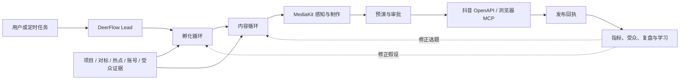
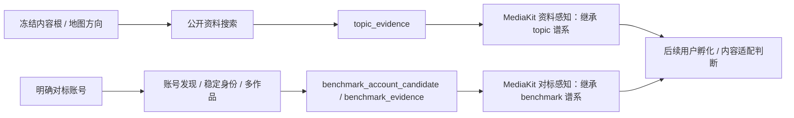
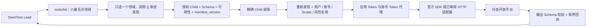

# 第六版内容孵化内核架构

## 目标

第六版首先解决“模型拿到一句我是做什么的之后，怎样正确理解对象、选择内容根、展开内容世界并说清判断”。它不把 MCN 手册、平台规则和行业案例塞进一个长提示词，也不让多个子 Agent 各自重猜一次完整业务。

## 整体运营编排

内容理解是孵化核心，但不是整个产品。完整系统采用“一个总脑、三条循环、两个执行底座、
一套事实台账”：



上图是产物之间的可能谱系，不是一条每次必须走完的流水线。Lead 按用户当前目标读取有界上下文，
只调用产生所需业务产物的能力。对标、MediaKit、平台 API、预演和复盘都不得重选内容根或修改
共享业务真相。完整决策、产物合同、硬门边界和迁移原则见
[`ADR-018`](decisions/ADR-018-artifact-graph-orchestration.md)；工作包与验收顺序见
[`IMPLEMENTATION_PLAN.md`](IMPLEMENTATION_PLAN.md)。

共享台账当前有两类读取产物：通用 `EvidenceSnapshot` 保留选题、平台规则等单次证据集；
`BenchmarkSnapshot` 保留第三方对标账号的稳定身份、作者一致作品和真实覆盖回执。
两者都内容寻址且只向 Lead 给出有界投影，但证据角色不能互换。对标快照只是观察；定位、受众、
获客期/当前迁移和不可复制条件属于引用快照的后续分析产物。

抖音读取采用官方优先路由。`search.video_search` 当前使用官方 v2 合同：选题检索生成
`topic_evidence`，对标发现生成 `benchmark_account_candidate`。搜索回执中的作者显示名没有稳定
账号身份。现有聚合层可在同一 Manifest 下跨页搜索，按归一后的显示名筛选、去重，
并将最多 24 条公开作品封存为项目级候选证据；它仍不能直接升级为
`BenchmarkSnapshot`。只有后续官方账号能力或经审阅的官方页面连接器取得稳定账号 ID、
作者一致作品和覆盖回执后，才能封存正式对标快照。星图和百应延期为明确字段缺口的
补充源；第五版 Playwright 采集器不作为默认路径迁移。

Lead 不直接看全量抖音 Child，当前只注册一个高层对标候选工具。它只接受
搜索语、目标作者显示名和样本上限，内部复用 DomainRouter 与候选聚合器。未选项目时
返回只读证据；选中项目时，项目 ID 由 Gateway 上下文转发，所有者始终从服务端认证
身份解析并在平台请求前检查。项目写入失败不会丢弃已采集证据，但会显式标记未保存。
Gateway 已提供 owner-scoped 项目创建、读取、线程绑定和解绑 API；运行请求中的项目 ID 被视为
不可信输入并清除，`start_run` 只重水化线程上的服务端绑定。前端项目选择器仍属 W07，真实抖音
凭据验收仍是 W02 未完成项。

### 资料证据、对标证据与媒体感知

内容地图查资料与对标账号采集是两条不可互换的上游：



`content_intelligence.SourceItem` 只接受 `user_material` 和 `topic_evidence`。
任何搜索源显式返回对标角色都会被丢弃；抖音内容研究回执还必须显式为
`topic_evidence`，不得将缺失角色或对标回执重标为选题证据。对标链路反过来也不得用一条
视频或搜索摘要代替稳定账号身份和多作品覆盖。

MediaKit 能直接接受 `video_url`，但这里的 URL 是可直接访问的视频资源，
不是抖音分享页或作品 HTML 页。平台连接先作为可持久证据进入平台解析器；
解析器只有在响应已确认为 `video/*` 时才可生成 `EphemeralMediaSource`。
签名直链或本地路径只在调用内存中存在；`MediaSourceReceipt` 仅保留来源、权利、
解析器、哈希和时间。`MediaKitCapabilityRouter` 按当前 CLI 动态发现 Schema，并已通过
本机 `0.2.0` 的本地元信息真实执行。源文件在命令前后核对内容哈希；CLI 原始输出还必须进入
能力专属的窄结果合同，因为当前元信息 Output Schema 只描述云端提交，不能单独证明本地返回有效。
`MediaObservationSnapshot` 自动继承来源产物的证据角色。真实平台解析仍未验收。云任务将复用
DeerFlow 租约轮询；运行时现已支持 `submission_pending`：先持久化幂等提交意图，后台领取租约后
才调用远端并绑定
任务句柄。MediaKit 无取消能力，云驱动只能使用这条路径，并把本地任务 ID 映射为
`client_token`；旧的先提交后落库路径不能用于 MediaKit。提交意图不得包含凭据、临时 URL 或
本机路径。A51 的隔离驱动已通过无费用模拟：每次只查询一次，归一两套已观察到的供应商状态，
完成输出经受信物化器转成 `artifact://` 引用和内容哈希，授权、来源解析与物化异常使用固定错误
信封。它尚未注册；具体授权器、短命来源解析器、下载质检和真实云能力仍需逐项验收。

## 内容理解纵切

```mermaid
flowchart LR
    USR["用户原话"] --> LEAD["DeerFlow Lead"]
    LEAD -->|"宽泛起号或长期内容请求"| TOOL["explore_content_world"]
    TOOL --> SEM["语义阅读专家"]
    SEM --> EVIDENCE["可选本地词义证据：整词 / 真子成分 / 词族"]
    SEM --> LEX["隔离词义：只看 lexical_head"]
    EVIDENCE -->|"有界只读投影"| LEX
    LEX --> SHARED["语义家族 / 直接实践共同世界"]
    SHARED --> REVIEW["共同世界反事实审查"]
    REVIEW --> ASSEMBLE["代码装配候选及来源类型"]
    ASSEMBLE --> DECIDE["冻结候选裁决专家"]
    DECIDE -->|"只传 content_root"| MAP["账号级冻结根地图专家"]
    MAP --> POSITION["长期承诺 / 稳定观察方法 / 内容疆域 / 防漂移边界"]
    POSITION --> VERSION["内容寻址的地图版本"]
    MAP --> PROSE["失败开放备用：地图正文"]
    VERSION --> NAMED["模型命名联想"]
    VERSION --> QUERY["地图方向联网发现"]
    NAMED --> VERIFY["联想候选联网核验"]
    QUERY --> MERGE["搜索回执去重"]
    VERIFY --> MERGE
    MERGE --> FETCH["受控打开公开正文"]
    FETCH --> READ["证据阅读专家"]
    READ --> EDIT["创意收敛：不是独立编剧 Agent"]
    EDIT -->|"证据足够"| TOPIC["TopicBrief"]
    EDIT -->|"存在完整行动链"| FRAME["可选 NarrativeFrame"]
    FRAME --> TOPIC
    TOPIC --> PLAN["MessagePlan：事情 / 立场 / 切入口 / 视角 / 揭示 / 回报"]
    PLAN --> BASE["确定性基础文案"]
    BASE --> JOIN["确定性渲染具体交付"]
    TOPIC -. "交付合同失败" .-> PROSE
    EDIT -. "证据不足" .-> PROSE
    PROSE --> JOIN
    JOIN --> MSG["带直达标记的隐藏 ToolMessage"]
    MSG --> EXIT["return_direct 结束模型循环"]
    EXIT --> TERMINAL["终局中间件提升一次"]
    TERMINAL --> OUTPUT["唯一可见 AIMessage"]
    SEM --> RECORD["ComprehensionRecord / BusinessSemanticView"]
    DECIDE --> WORLD["ContentWorldView"]
    MAP --> WORLD
```



## 共享记录

`ComprehensionRecord` 只保存：

- 来源材料及内容哈希
- 来源直接支持的观察
- 实体、角色、关系和状态变化
- 带依据与限制的派生解释
- 明示为假设的开放世界联想
- 反证和未知

记录内 ID 全局唯一；来源引用、实体引用和依据引用必须解析到同一记录，引用类型也必须一致。这个约束阻止“把解释写进事实槽”在数据层静默传播，但不判断某个行业应该选什么内容根。

## 三个投影与下游交付

- `BusinessSemanticView`：解释商业对象、词法主词、修饰关系、主体动作，并保留经隔离分析得到的意义核与语义家族。
- `ContentWorldView`：账号级内容地图，组织长期内容根、观众关注承诺、稳定观察方法、防漂移边界、内容疆域与命名候选；不包含商品锚点或商业回桥。
- `TopicBrief`：绑定一个内容地图版本，从内容根起步的一条已理解路径中收敛问题、中心命题、机制、反面解释与证据边界；只有证据支持完整行动链时才附带 `NarrativeFrame`。

投影可以缺席，字段列表可以为空。它们不负责表现形式、平台写法、销售、变现、实验或发布，避免下游任务倒灌到阅读理解层。

`MessagePlan` 和 `BaseDraft` 是 `TopicBrief` 之后的下游交付，不是第四个阅读投影。前者显示具体主体、
可选情境、事情或问题、用户立场、观点，以及一个主切入口、讲述视角、诚实观众问题、信息揭示顺序
和最终回报；后者只确定性组合已审议的开头、正文与收束。
它们既不重新选根，也不预选口播、短剧、图文或纯素材。

线程绑定项目时，同一次成功纵切会把运行记录与长期地图分开封存，再建立如下父级：

```text
selected topic_evidence -> content_reading
content_reading + content_world
                -> topic_brief
                -> message_plan
                -> draft_version
```

`content_reading` 保留本次阅读、根选择候选、命名候选和未知；`content_world` 只保留稳定定位，
因此一次新的搜索材料不会静默制造新地图版本。所有运行身份来自服务端注入的
`ToolRuntime.context`，不出现在模型参数中。没有选项目时生成仍可继续，持久化失败也不覆盖已生成
内容；只有后续制作、发布和复盘明确引用这些内容寻址产物时，项目台账才成为业务真相来源。

抖音公开视频作为内容资料时只走运行时已加载的 `douyin_search` MCP 领域：先空对象发现当前
Manifest，再精确调用 `video_search`，用途固定为 `topic_research`。Web 搜索与抖音 MCP 可以作为
并列资料源，但对标候选角色不能进入本管道。只有最终证据阅读实际保留了该快照中的公开 URL，
快照才以 `topic_evidence` 先于阅读产物封存；未采用的搜索结果不会为了完整感写入项目。

## 受控多专家协作

黄金礼品失败基线证明，一次结构化调用同时要求语义、地图和起号交付会产生注意力竞争；后续真实回执又证明，让一个工作者同时生成候选、选择赢家和解释赢家，会形成自证式收敛。当前链路按以下受控职责分工，根后发现阶段允许受控并行：

1. 语义阅读只拆商业表达、对象角色和修饰关系，不选内容方向。`source_object` 与 `lexical_head` 必须原样摘录用户表达；完整被服务对象使用最小通用名称，不继承可移除的地域、材质、价格或人群修饰。
2. 隔离词义工作者只看 `lexical_head`，看不到用户、商品、行业、修饰语和起号问题。它区分词法主词、真正保持含义的语义核和纯拆字。可选本地词义证据只补充整词义项、严格子串与有类型的词族关系；缺失或失败时仍走原纯模型路径。代码删除整词、外部词和未绑定分支；有证据时分支必须逐字绑定检索结果。只有社会关系、文化制度和人类关切可触发跨域语义家族。自然来源、材质、感官属性、经营场所、集合容器和普通对象不可冒充这三类。经隔离工作者选定的词内实际义项以 `selected_meaning_in_head` 传给下游，词族例子不得覆盖它。
3. 共同世界工作者只能看两种互斥输入之一：存在有效语义核时，只看语义核、已选义项和跨域语义家族；否则只看去修饰主词的直接活动、功能和场景。语义阅读者冻结会改变人物、共同事件、关系或生命周期的 `required_constitutive_contexts`，共同世界只负责保留和合成，不再二次推翻。前一模式不得退回某一具体行为，并以普通人可理解的生活问题命名共同世界；若意义核本身就是普通词，名称必须保留它，不能擦除成泛泛的“规则、文化、生活”。上下游对构成语境不一致时，代码撤下该泛化世界，而不是静默选择。
4. 独立审查者只检查这个共同世界是否真由输入语义构成。换成大量无关对象后仍完整成立的普通使用、消费、制作、交易或聚会场景会被退回；语义家族模式下，只覆盖单一分支的世界也不成立。
   共同世界是可选候选生成器；连续两次结构化输出不可用时写入未知并继续使用其他候选，不得拖死地图。
5. 代码从原始对象、词法主词、语义核、完整被服务对象、活动、功能和通过审查的共同世界装配候选，不再让另一个模型自由改名或拼接候选。候选保留来源类型，具体场景仍是不可选择的分支。
6. 根裁决只看到对象角色与冻结候选的来源类型、名称。可选索引只在 `root_candidate` 子集中解释，代码层不允许 `example_branch` 成为内容根或观众领地；经营容器的店务流程和中间实现物不能仅因内容多就压过完整对象。若一个窄候选只是较大候选中的一个分支，而较大候选仍保留意义核、双向解释与具体人事，窄候选不能只因离商品近而胜出。
7. 地图专家只看冻结的 `content_root`，看不到商品、用户原话和销售目标。它在同一次调用中形成账号长期承诺、稳定观察方法、防漂移边界和内容疆域，不生成每日选题，也不选择表现形式。
8. 冻结地图同时启动两路发现：模型按地图联想可核验专名，联网搜索则直接从实际地图方向发现真实材料；前者不能垄断查询预算，后者不等待前者给出名字。
9. 两路搜索回执合并去重后，先受控打开公开正文，再由证据阅读按来源强度选择路线，区分观察、关系、状态变化、解释、限制和未知，不负责立题。
10. 创意收敛只根据已经读出的证据形成 `TopicBrief`，证据不足时明确弃权；它不是额外的编剧 Agent。
11. 已取证 `TopicBrief` 进入扁平 `MessagePlan`，将内部选题收敛为“谁在什么情境遇到什么事，账号站在用户什么真实位置给出什么观点”，并明确从哪里切入、沿什么视角、让观众追问什么、如何逐层揭示和最终兑现什么。相同 TopicBrief 的不同讲法具有不同计划身份。
12. 代码将已审议的开头、内容推进和收束组合成形式无关的 `BaseDraft`。宽泛起号请求成功时先返回账号内容定位，再给一个地图内的“今日建议拍摄”；无选题或交付失败时，内容世界总编只看冻结根与地图生成失败开放回执。

命名联想的理由与搜索词是检索假设，不是事实，也不是下游必须兑现的选题合同。证据阅读只接收路线 ID、发现方式、地图方向、可选联想实体和来源回执；搜索词与召回理由均被剥离。地图方向路线可从证据中识别新实体，联想路线则禁止偷偷换名。阅读可比较多条路线，但确定性投影只保留获胜路线的观察和来源；旁路噪声不能支撑选题，也不能把整份有效阅读连带作废。

## 地图与创意收敛边界

内容地图首先是账号定位：`content_root` 决定长期讲什么，`editorial_promise` 决定观众反复获得什么，`recurring_lens` 决定账号怎样持续观察世界；维度与路径再回答“冻结根周围有哪些可研究的人、时间、地点、事件、种类、文化、作品和关系”。它不包含一个名为“冲突”的固定轴，也不把座次、让步、观点差异、利益差异、情绪波动或一般关系张力升级成故事。

地图版本只由长期定位和内容疆域决定。研究阶段后来发现的人物、作品、事件和证据不会改变版本；每个 `TopicBrief` 必须携带同一版本 ID，并从内容根作为路径第一步。实时热点可以成为某条路径上的新事件，但不能凭热度重写内容根、关注承诺或观察方法。这正是“做 IP”和“每天做视频”的工程分界。

地图分支经过联网取证后直接进入创意收敛，形成“这次到底讲什么”。这里不再设一个独立的编剧脑或自由行动的编剧 Agent。`NarrativeFrame` 只是故事型材料的一种可选结果，只有以下六项都能引用到账本观察时才出现：

- 主体或主角
- 具体目标
- 阻碍
- 行动或选择
- 失败、放弃或行动所带来的代价
- 结果或变化

说明、比较、知识和历史梳理不需要强行变成故事。叙事推断若超出来源直述，必须保留限制；缺一项时保持 `NarrativeFrame = null`，但不因此阻止一个有证据的非叙事 TopicBrief。`MessagePlan` 先把选题变成可继续制作的信息结构，但不选表现形式。真正把它适配为口播、微短剧、情景剧、图文或纯素材属于后续路由；只有选择叙事形式时才调用编剧方法。

讲述策划不是“震惊体”生成器。标题和开头可以制造诚实的信息差，但不能替代切入口、视角、证据
推进和回报；来源名称通常留在参考资料，用户职业只决定观察位置，不要求店铺或商品进入正文。
当前运行时只生成一次讲述策划与基础文案。围绕冻结视角再补搜场景、动作和细节的二次研究仍是
待比较候选，不得冒充已经接通。

它们是同一工具内的受控模型工作者，不是可自由调工具、修改状态的 DeerFlow `task` 子 Agent。这个边界保留了分工，同时避免多个 Agent 各自建立一套业务真相。

`explore_content_world` 的模型可见参数只有逐字复制的 `user_request`。Lead 不得在同一轮并行调用通用 `web_search`，也不能用自己改写的“平台运营需求”充当用户来源。联网取证只能发生在内容根冻结之后；搜索失败、合同失败或弱证据弃权都保留原语义根和地图。

外层 Lead 可以使用供应商思考模式；工具内受控工作者固定关闭供应商隐藏思考。它们通过结构化中间记录暴露判断，避免 DeepSeek 等接口在“思考模式 + 结构化工具选择”下拒绝请求，也避免每个小工位重复消耗长推理 Token。

## 供应商结构化输出边界

最终正文总编之前的结构化专家请求 LangChain 同时返回解析结果与原始 AIMessage。兼容层可从同一次工具参数中恢复供应商误编码的预期容器，然后仍执行 Pydantic 合同校验；结构无法恢复时最多要求模型原样重返一次。单一结构合同若收到多个工具调用会被确定性拒绝并进入该次修复，禁止静默取第一份。总编的长文正文不再强制 JSON，避免中文引号把合法判断变成协议失败。总编调用不继承父运行的 UI 流式回调。

总编正文先作为带 `deerflow_direct_response` 标记的隐藏 `ToolMessage` 返回。此时消息序列中的最后一个 AI 仍是原始工具调用，所以 LangChain 的 `return_direct` 路由能够结束模型循环；随后 `TerminalResponseMiddleware.after_agent` 把正文提升为一个可见 `AIMessage`。禁止在工具节点内直接追加 AI 消息，否则路由会误判并再次调用 Lead。

根后研究默认最多发出 6 个查询、最多 3 个查询并发、每个查询最多接收 3 个结果、总计最多保留 8 个证据项。地图方向和模型联想查询交替取预算；第一条地图查询与命名联想同时启动。地图查询只使用冻结根和实际方向，不机械追加“人物、事件、作品、记录”等泛词。相同 URL 只保留一份内容。公开页进入任一读取器前必须先通过公网地址校验；本地读取每次最多 2 MB，每个来源最多 6000 字符进入证据包，最多 3 次跳转且每一次都重新校验公网地址，只接受文本与 HTML。本地提取失败时才调用运营者配置的 `web_fetch`；两者都失败则保留搜索摘要。搜索、读取、模型或 Schema 异常都不能改变冻结根。这些都是技术上限，不是内容配额。

联网研究调用当前配置的 `web_search`，不再硬编码 DuckDuckGo。免费的 DDG 只作为可失败的降级通道；字节官方 Web Search 可通过 `deerflow.community.byted_search.tools:web_search_tool` 接入，但需要独立的 `WEB_SEARCH_API_KEY`，不能复用 Ark 模型密钥。普通公开搜索回执一律标记为 `topic_evidence`。即使结果碰巧是视频页或账号页，也不能据此推断账号定位、内容模式、受众或成绩；对标账号必须进入独立账号采集与多作品回执链路。

## 抖音 OpenAPI 能力网关

抖音平台能力不进入内容智能提示词，也不把全部 OpenAPI 平铺成 Lead 工具。独立 MCP 网关保存版本化能力清单、应用和账号级鉴权、风险策略、幂等状态与完整平台回执；DeerFlow 只接收当前任务所需的有界投影。



该分层合同对齐 Apache Doris MCP Server 1.0 及发布后 `#199` 的成熟模式，但不引入其 Doris 专属运行时。一次任务先选唯一最匹配领域，不推测性展开多个 Manifest；领域描述必须互斥并写明排除项。当前 119 条官方目录记录按预算落入 16 个领域，最大领域 18 条；其中 106 条属于主动调用、6 条需由接入方实现、5 条是 OAuth、1 条是入站 Webhook、1 条是本地加密规范。官方页面中还有 68 条当前是空壳或迁移状态，只保留谱系，不推断调用合同。未经授权的 Child 不披露；已授权而不可用的 Child 保留 `callable=false` 与稳定原因码。目录、Schema 和文档从同一份能力定义生成，旧 Manifest 在 Scope、账号、平台能力或策略变化后必须失效。视频和图文搜索属于公开选题证据；授权账号资料、关系和粉丝画像属于自有或客户授权账号复盘；对标账号拆解属于独立采集链；发送、创建、修改、删除、扣减和发布属于需审批执行。目录发现、接口接入和生产启用是三个不同状态，不能因文档中存在某 API 就宣称当前应用已经可用。

## 商业回桥边界

“商业回桥”来自早期对“不卖而卖”的工程化尝试：希望内容世界最终能回到商业对象。这个业务意图本身可以成立，但将它放进语义和地图合同会迫使模型持续回到商品。因此 `ContentWorldView` 已删除 `object_anchor`、`return_path` 和任何同义字段。未来的商业承接若实现，必须读取已冻结地图后另行生成，不能回写或缩窄内容根。

## 词义证据与向量边界

当前可选实现是只读 `LexicalEvidenceProvider`，本地 CC-CEDICT SQLite 索引保存版本、许可证、
内容摘要、整词义项和词条。查询只返回严格子串、精确词条与有界前缀、后缀、词内关系，模型
上下文默认不超过 7 KB；专名义项可见但不用于普通词族扩展，借词或音译整词会停止机械拆字。
词典没有独立决策权，也不进入通用记忆、事实账本或搜索结果。

A32 曾在隔离的 `backend/experiments/lexical_vector` 中对稠密向量候选完成七案四臂冻结比较。
向量只在已选义项后运行，但真正产生候选的两个案例均被带向更泛或更糟的内容根。
因此该候选已被 ADR-014 拒绝：默认分析器没有 `semantic_recall` 接口或提示，仓库不保留向量索引、模型工件、检索器、构建脚本或专用测试；只保留 ADR 和有界结果台账。

## 暂不引入

默认运行时不引入稠密向量库、知识图谱数据库、行业关键词路由、固定问卷、固定候选数或完整 MCN 工作流。当前接通轻量网页搜索和受控公开正文读取；来源等级、浏览器证据和账号证据仍是后续模块，不能由搜索摘要冒充。
