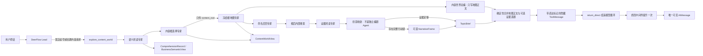

# 第六版内容孵化内核架构

## 目标

第六版首先解决“模型拿到一句我是做什么的之后，怎样正确理解对象、选择内容根、展开内容世界并说清判断”。它不把 MCN 手册、平台规则和行业案例塞进一个长提示词，也不让多个子 Agent 各自重猜一次完整业务。

## 共享记录

`ComprehensionRecord` 只保存：

- 来源材料及内容哈希
- 来源直接支持的观察
- 实体、角色、关系和状态变化
- 带依据与限制的派生解释
- 明示为假设的开放世界联想
- 反证和未知

记录内 ID 全局唯一；来源引用、实体引用和依据引用必须解析到同一记录，引用类型也必须一致。这个约束阻止“把解释写进事实槽”在数据层静默传播，但不判断某个行业应该选什么内容根。

## 三个投影

- `BusinessSemanticView`：解释商业对象、词法主词、修饰关系和主体动作。
- `ContentWorldView`：组织长期内容根、维度、路径与命名候选；不包含商品锚点或商业回桥。
- `TopicBrief`：从一条已理解路径中收敛问题、中心命题、机制、反面解释与证据边界；只有证据支持完整行动链时才附带 `NarrativeFrame`。

投影可以缺席，字段列表可以为空。它们不负责表现形式、平台写法、销售、变现、实验或发布，避免下游任务倒灌到阅读理解层。

## 受控多专家链

黄金礼品失败基线证明，一次结构化调用同时要求语义、地图和起号交付会产生注意力竞争。当前链路由七个受控专家串行协作：

1. 语义阅读只拆商业表达，不选内容方向。
2. 内容根选择只比较对象、活动、功能和关系世界，不展开地图；完整商品或服务没有先验优先权，选择目标是与原表达直接相连的最大有效内容世界。
3. 地图专家只看冻结的 `content_root`，看不到商品、用户原话和销售目标。
4. 命名召回只看冻结根和地图，寻找可核验的人物、事件、作品、制度、习俗或地点。
5. 证据阅读只读白名单搜索回执，区分观察、关系、状态变化、解释、限制和未知，不负责立题。
6. 创意收敛只根据已经读出的证据形成 `TopicBrief`，证据不足时明确弃权；它不是额外的编剧 Agent。
7. 内容世界总编只把语义跃迁和冻结地图整理成 Markdown，不重新做起号、卖货或平台判断；确定性渲染器随后追加可选的证据选题，正文模型看不到也不能改写它。

命名召回的理由与搜索词是检索假设，不是事实，也不是下游必须兑现的选题合同。证据阅读只接收候选 ID、命名对象、地图维度和白名单来源回执；选题总编只接收候选身份与规范化阅读记录。未经取证的召回猜测不能进入最终路径、命名候选连接或 TopicBrief。

## 地图与创意收敛边界

内容地图回答“冻结根周围有哪些可研究的人、时间、地点、事件、种类、文化、作品和关系”，只负责发散。它不包含一个名为“冲突”的固定轴，也不把座次、让步、观点差异、利益差异、情绪波动或一般关系张力升级成故事。

地图分支经过联网取证后直接进入创意收敛，形成“这次到底讲什么”。这里不再设一个独立的编剧脑或自由行动的编剧 Agent。`NarrativeFrame` 只是故事型材料的一种可选结果，只有以下六项都能引用到账本观察时才出现：

- 主体或主角
- 具体目标
- 阻碍
- 行动或选择
- 失败、放弃或行动所带来的代价
- 结果或变化

说明、比较、知识和历史梳理不需要强行变成故事。叙事推断若超出来源直述，必须保留限制；缺一项时保持 `NarrativeFrame = null`，但不因此阻止一个有证据的非叙事 TopicBrief。真正把选题写成口播、微短剧、情景剧、图文或纯素材内容，属于后续表现形式适配；只有选择叙事形式时才调用编剧方法。

它们是同一工具内的受控模型工作者，不是可自由调工具、修改状态的 DeerFlow `task` 子 Agent。这个边界保留了分工，同时避免多个 Agent 各自建立一套业务真相。

`explore_content_world` 的模型可见参数只有逐字复制的 `user_request`。Lead 不得在同一轮并行调用通用 `web_search`，也不能用自己改写的“平台运营需求”充当用户来源。联网取证只能发生在内容根冻结之后；搜索失败、合同失败或弱证据弃权都保留原语义根和地图。

外层 Lead 可以使用供应商思考模式；工具内受控工作者固定关闭供应商隐藏思考。它们通过结构化中间记录暴露判断，避免 DeepSeek 等接口在“思考模式 + 结构化工具选择”下拒绝请求，也避免每个小工位重复消耗长推理 Token。

## 供应商结构化输出边界

最终正文总编之前的六个专家请求 LangChain 同时返回解析结果与原始 AIMessage。兼容层可从同一次工具参数中恢复供应商误编码的预期容器，然后仍执行 Pydantic 合同校验；结构无法恢复时最多要求模型原样重返一次。总编的长文正文不再强制 JSON，避免中文引号把合法判断变成协议失败。总编调用不继承父运行的 UI 流式回调。

总编正文先作为带 `deerflow_direct_response` 标记的隐藏 `ToolMessage` 返回。此时消息序列中的最后一个 AI 仍是原始工具调用，所以 LangChain 的 `return_direct` 路由能够结束模型循环；随后 `TerminalResponseMiddleware.after_agent` 把正文提升为一个可见 `AIMessage`。禁止在工具节点内直接追加 AI 消息，否则路由会误判并再次调用 Lead。

根后研究默认最多发出 3 个查询、每个查询最多接收 3 个结果、总计最多保留 8 个证据项。这些是技术成本上限，不是业务输出配额。查询在候选之间轮转，避免第一个候选耗尽预算。只允许 `http/https` 的标题、链接和摘要进入证据回执；每条观察只能引用所选候选名下的来源，选题总编也只看阅读实际引用的来源回执。搜索、模型接口异常和 Schema 漂移都不能改变冻结根。

## 商业回桥边界

“商业回桥”来自早期对“不卖而卖”的工程化尝试：希望内容世界最终能回到商业对象。这个业务意图本身可以成立，但将它放进语义和地图合同会迫使模型持续回到商品。因此 `ContentWorldView` 已删除 `object_anchor`、`return_path` 和任何同义字段。未来的商业承接若实现，必须读取已冻结地图后另行生成，不能回写或缩窄内容根。

## 暂不引入

首版不引入向量库、知识图谱数据库、行业关键词路由、固定问卷、固定候选数或完整 MCN 工作流。当前只接通轻量网页搜索回执；全文抓取、来源等级、浏览器证据和账号证据仍是后续模块，不能由搜索摘要冒充。
