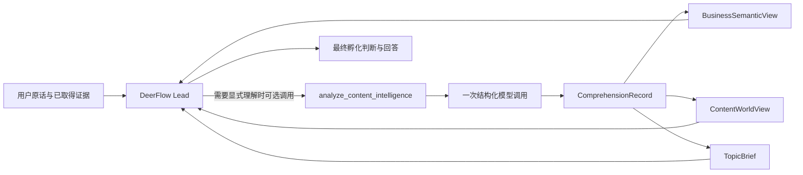

# 第六版内容孵化内核架构

## 目标

第六版首先解决“模型拿到一句我是做什么的之后，怎样正确理解对象、展开内容世界并形成值得讲的具体问题”。它不是把 MCN 手册、平台规则和行业案例塞进一个长提示词，也不是让多个子 Agent 各自重猜一次商业主体。

## 共享记录

`ComprehensionRecord` 只保存：

- 来源材料及内容哈希
- 来源直接支持的观察
- 实体、角色、关系和状态变化
- 带依据与限制的派生解释
- 明示为假设的开放世界联想
- 反证和未知

记录内 ID 全局唯一；来源引用、实体引用和依据引用必须解析到同一记录，引用类型也必须一致。这个约束阻止“把解释写进事实槽”在数据层静默传播，但不判断某个行业应该选什么内容根。

## 三个投影

- `BusinessSemanticView`：解释商业对象、词法主词、修饰关系和主体动作。
- `ContentWorldView`：组织长期内容根、维度、路径、命名候选及返回商业对象的路径。
- `TopicBrief`：从一条已理解路径中收敛问题、中心命题、机制、反面解释与证据边界。

投影可以缺席，字段列表可以为空。它们不负责表现形式、平台写法、销售、变现、实验或发布，避免下游任务倒灌到阅读理解层。

## Agent 与多 Agent

当前候选只做一次结构化模型调用，减少重复猜测和上下文损耗。以后可以比较多 Agent，但必须满足：

- 所有贡献者读取同一 `ComprehensionRecord`。
- 子 Agent 只能补充证据或候选投影，不得建立第二份业务真相。
- Lead 负责处理冲突、决定采用或拒绝，不允许投影评分阻断回答。
- 是否增加 Agent 由留出评测的业务结果决定，不由架构偏好决定。

## 供应商结构化输出边界

分析器请求 LangChain 同时返回解析结果与原始 AIMessage。正常结果直接进入合同；如果供应商把本应为对象或列表的已知容器字段编码成 JSON 字符串，兼容层可从同一次工具参数中解码后再次执行本地 Pydantic 校验。它不会二次调用模型，也不会接受任意字段的字符串执行或放宽来源引用。

## 暂不引入

首版不引入向量库、知识图谱数据库、行业关键词路由、固定问卷、固定候选数或完整 MCN 工作流。模型已有知识可用于召回候选，但在没有来源时只能进入假设层；需要事实确认时再接搜索、浏览器或账号证据工具。
