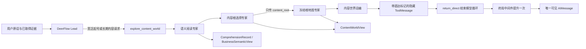

# 第六版内容孵化内核架构

## 目标

第六版首先解决“模型拿到一句我是做什么的之后，怎样正确理解对象、选择内容根、展开内容世界并说清判断”。它不把 MCN 手册、平台规则和行业案例塞进一个长提示词，也不让多个子 Agent 各自重猜一次完整业务。

## 共享记录

`ComprehensionRecord` 只保存：

- 来源材料及内容哈希
- 来源直接支持的观察
- 实体、角色、关系和状态变化
- 带依据与限制的派生解释
- 明示为假设的开放世界联想
- 反证和未知

记录内 ID 全局唯一；来源引用、实体引用和依据引用必须解析到同一记录，引用类型也必须一致。这个约束阻止“把解释写进事实槽”在数据层静默传播，但不判断某个行业应该选什么内容根。

## 三个投影

- `BusinessSemanticView`：解释商业对象、词法主词、修饰关系和主体动作。
- `ContentWorldView`：组织长期内容根、维度、路径与命名候选；不包含商品锚点或商业回桥。
- `TopicBrief`：从一条已理解路径中收敛问题、中心命题、机制、反面解释与证据边界。

投影可以缺席，字段列表可以为空。它们不负责表现形式、平台写法、销售、变现、实验或发布，避免下游任务倒灌到阅读理解层。

## 受控多专家链

黄金礼品失败基线证明，一次结构化调用同时要求语义、地图和起号交付会产生注意力冲突。现在分成四个受控专家：

1. 语义阅读只拆商业表达，不选内容方向。
2. 内容根选择只比较对象、活动、功能和关系世界，不展开地图。
3. 地图专家只看冻结的 `content_root`，看不到商品、用户原话和销售目标。
4. 总编只把语义跃迁和已有地图收敛成 Markdown，不重新做起号、卖货或平台判断。

它们是同一工具内的受控模型工作者，不是可自由调工具、修改状态的 DeerFlow `task` 子 Agent。这个边界保留了分工，同时避免四个 Agent 各自建立一套业务真相。

## 供应商结构化输出边界

前三个专家请求 LangChain 同时返回解析结果与原始 AIMessage。兼容层可从同一次工具参数中恢复供应商误编码的预期容器，然后仍执行 Pydantic 合同校验；结构无法恢复时最多要求模型原样重返一次。总编的长文正文不再强制 JSON，避免中文引号把合法判断变成协议失败。总编调用不继承父运行的 UI 流式回调。

总编正文先作为带 `deerflow_direct_response` 标记的隐藏 `ToolMessage` 返回。此时消息序列中的最后一个 AI 仍是原始工具调用，所以 LangChain 的 `return_direct` 路由能够结束模型循环；随后 `TerminalResponseMiddleware.after_agent` 把正文提升为一个可见 `AIMessage`。禁止在工具节点内直接追加 AI 消息，否则路由会误判并再次调用 Lead。

## 商业回桥边界

“商业回桥”来自早期对“不卖而卖”的工程化尝试：希望内容世界最终能回到商业对象。这个业务意图本身可以成立，但将它放进语义和地图合同会迫使模型持续回到商品。因此 `ContentWorldView` 已删除 `object_anchor`、`return_path` 和任何同义字段。未来的商业承接若实现，必须读取已冻结地图后另行生成，不能回写或缩窄内容根。

## 暂不引入

首版不引入向量库、知识图谱数据库、行业关键词路由、固定问卷、固定候选数或完整 MCN 工作流。模型已有知识可用于召回候选，但在没有来源时只能进入假设层；需要事实确认时再接搜索、浏览器或账号证据工具。
