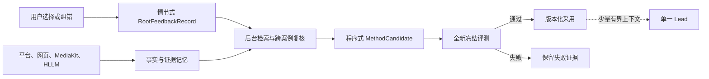

# A108 Agent 社区的记忆、评测与自进化方法审计

## 研究问题

用户已经通过黄金礼品、海鲜、火锅底料、水果、房车和助听器等案例持续纠正内容根。第六版也已有抖音
证据、MediaKit、HLLM、方法 Skill、项目台账与离线评测。现在需要回答：主流 Agent 社区有哪些方法能让
这些资产真正提高内容根判断，而不是再叠一个知识库、运行时或固定流程？

## 结论

各社区虽然术语不同，交集非常稳定：

> **把外部事实、已确认案例和可复用方法分层保存；在后台形成经验；在线只检索少量相关内容；用独立评测
> 决定新版本能否晋级。**

这与 A96 的方向一致，但本地少了最基础的一环：`RootFeedbackRecord` 之前只存在于文档，真实纠错没有
可运行的数据合同。A108 因此先实现追加式反馈工件，不把它接入 Lead，也不启动自动检索或提示词优化。

## 社区方法对照

| 来源 | 可用方法 | 适合第六版的部位 | 当前判定 |
| --- | --- | --- | --- |
| OpenAI | 模型、工具、指令三要素；先建立评测基线；单 Agent 优先；数据与 trace grading | Lead 保持唯一判断权，外部数据通过工具进入，版本升级看评测 | 立即采用原则，不引入新运行时 |
| Anthropic | 最小可组合架构；上下文工程；外部笔记/记忆；有清晰标准时才用 evaluator-optimizer | 有界证据包、后台经验整理、冻结留出集 | 立即采用；评价标准不清时禁用反思循环 |
| Anthropic 多 Agent | Orchestrator-worker 适合并行、宽范围研究，但成本高且需要明确分工 | 对标发现、资料取证、批量离线候选 | 只作研究工人；不投票裁决内容根 |
| LangMem/LangGraph | semantic、episodic、procedural 三类记忆；后台形成；Store 可检索 | 事实证据、纠错案例、方法候选三层 | 采用分类，不安装第二套记忆运行时 |
| AutoGen | Memory 协议和 RAG；generator-reviewer 反思 | 提醒记忆需要查询与注入边界；清晰 rubric 下可复核合同 | 采用接口思想；不运行 AutoGen 团队 |
| DSPy | BootstrapFewShot、MIPROv2、SIMBA、GEPA；由数据和 metric 编译提示/示例 | 确认案例足够后，离线优化根选择器 | 延期；当前标签和留出指标仍不足 |
| ExpeL / Reflexion | 从成功和失败轨迹提炼自然语言经验，并在后续任务召回 | 用户确认的根判断和反例 | 采用经验结构；模型自评不能确认真值 |
| Dynamic Cheatsheet / ACE | 紧凑、持续演进的策略手册；生成、反思、策展分离；增量更新避免上下文坍缩 | 将多次复现的案例蒸馏为版本化方法候选 | 延期到案例层稳定后，禁止在线改核心提示 |
| Agent Workflow Memory / Voyager | 从轨迹提取可复用工作流或验证成功的技能 | 浏览器采集、MediaKit、发布与恢复等确定性执行 | 后续采用；不适合裁决主观营销内容根 |
| Agent Lightning | 把 trace 和 reward 转为 SFT/RL/提示优化，兼容不同 Agent 框架 | 有客观长期反馈后的离线训练 | 远期；单条播放量不能充当奖励 |

## 三层领域记忆

不引入一个笼统“营销知识库”，而是在 DeerFlow 现有项目台账里区分三类内容：

### 1. 事实与证据记忆

保存用户明确事实、词义证据、对标作品、平台观察、MediaKit 时序观察、受众覆盖和来源有效期。它回答
“我们实际知道什么”，不回答“最终应该选哪个根”。抖音热度、同赛道账号数量和高播放只能说明候选可能
可生长，不能证明语义正确。

### 2. 情节式案例记忆

保存一次完整判断经历：用户原话、商业对象、模型候选、模型选中的根、用户接受/拒绝/新增的候选、理由、
条件、未知、IP 可行性、错误类型和版本谱系。正例和反例必须同时保留；房车和助听器不能被压成一个
“越抽象越好”的规则。

### 3. 程序式方法记忆

保存跨案例反复成立的判断方法，例如“经营容器不能遮住完整服务对象”或“功能关联不等于经营者具备独立
IP 条件”。它不是用户纠错的直接副本，只能由离线策展生成候选，并在全新留出集和人工抽查通过后晋级。

## 为什么现在不做向量库

向量检索解决“找相似文本”，不能判断“相似经验是否适用”。黄金礼品很容易检索到三金、婚礼和水贝；这
正是此前反复出现的错误。当前案例量很小，字段结构清晰，先用项目、商业对象、错误类型、候选关系、状态和
版本做确定性过滤，再让模型比较少量正例与反例，更容易审计。

只有在以下条件同时满足后才比较嵌入检索：

- 已有足够多、经用户确认且跨语义结构的案例；
- 关键词/元数据检索成为可量化瓶颈；
- 新留出集证明嵌入召回提高最终根判断，而不是只提高相似案例召回；
- 反例、争议案例和已退休经验不会被正例相似度淹没。

## 多 Agent 的正确位置

内容根最终判断仍由一个 Lead 收敛。子 Agent 可以并行做候选扩展、词义证据、平台搜索、对标拆解和反例
寻找；它们输出有来源的候选，不修改项目状态，也不通过多数投票制造伪共识。只有具备明确合同和客观验收的
任务，才适合 generator-reviewer 或 evaluator-optimizer 循环。

## 首个运行时切片

本轮新增 `deerflow.incubation.root_feedback`：

- `RootCandidateFeedback` 记录模型候选或用户新增候选，以及 `best / acceptable / rejected`；
- `RootFeedbackRecord` 记录原话、商业对象、被评估内容根、条件、未知、IP 可行性、四类错误与状态；
- `seal_root_feedback_record` 强制绑定精确的 `content_map_candidate` 父工件；
- 修订只能创建新工件，并将旧反馈作为父级，不能覆盖历史；
- 用户新增的最佳候选必须显式标记 `candidate_recall`；
- `no_strong_root` 是合法答案，条件成立时必须写明条件；
- 工件不含检索分数、提示词更新或自动晋级字段。

这只是可运行的领域合同。尚未新增前端确认卡、Lead 工具、自动捕获、检索注入、后台策展或 DSPy 优化。

验证回执：新增反馈合同聚焦测试 `8 passed`；与内容地图、项目台账及运行边界联合回归 `24 passed`；
最终后端非 live 全量回归 `12240 passed, 76 skipped, 17 warnings`。警告均来自既有依赖的弃用提示。

## 下一步顺序

1. 在内容根结果旁增加最小确认入口，让用户选择最佳、可接受、拒绝或无强根，并写入本合同。
2. 建立只读反馈查询，先按状态、错误类型、商业对象结构和项目过滤，返回小量正例与反例。
3. 用全新用户复核案例验证“无案例 / 仅正例 / 正例加反例”三组效果；未通过则不注入 Lead。
4. 只把分歧、高不确定、新关系和弱 IP 送入主动复核队列。
5. 样本与指标成熟后，再比较 DSPy GEPA/SIMBA 或小排序器；优化工件必须可回滚。
6. AWM、Voyager 或 Agent Lightning 优先研究确定性工具轨迹，内容根训练继续等待长期真值。

## 验收结论

主流社区没有提供一个开箱即用的“营销脑”，但已经提供了足够一致的工程方法。第六版不需要再换 Agent
框架，也不需要先上向量库。最有价值的升级是把用户纠错变成一等、追加式、可争议的案例记忆，再用证据、
反例和留出评测离线蒸馏方法。

这让外部数据真正扮演“丰富并校准脑子”的角色，而不是把搜索结果、对标账号或播放量误当成内容根裁判。
