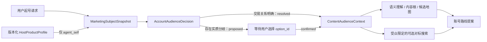

# A126 受众前置、营销主体与产品事实接线

## 本轮问题

首次起号链同时存在三个业务错误：

1. 系统在选内容根和账号路线之后才补“受众”，导致水果批发、零售和线上直销等不同生意被混成一套
   自嗨内容；付款者、决策者、使用者和长期内容观众也没有分开。
2. 用户说“你自己卖你自己”时，“你自己”本应指向当前 Agent，却被语义模块当成普通用户业务文本。
3. 当前 Agent 没有可信产品事实来源。模型只知道一句产品名称，因而可能补造能力、案例、资源和成绩。

目标不是增加一份人口统计问卷，而是在内容根、内容地图、对标搜索和账号路线之前先确认：营销主体是谁、
业务真正需要影响谁、对方为什么持续看，以及希望对方采取什么行动。

## 研究对照

市场细分、目标市场、Jobs-to-be-Done 和 B2B 采购角色资料共同支持先区分交易关系和目标人群，再选择
表达策略。但这些资料不证明所有业务都必须经过固定访谈流程。因此本轮采用的是可空、可修正的冷启动
假设：用户原话已明确交易关系时直接解析；只有 B 端/C 端、付款者/使用者或渠道/终端等分歧会实质改变
账号方向时，才暂停并请用户选择。

本轮严格区分三类对象：

- `AccountAudienceDecision`：起号时的业务目标人群与内容受众假设。
- 后续 `AudienceSnapshot`：平台或真实运营中观察到的人群证据。
- 人口统计画像：只有正式来源提供时才进入观察，不由模型在冷启动阶段编造。

## 实施合同

- `subject_ref=user_business` 只把用户逐字请求作为业务事实，不继承 Agent 产品事实。
- `subject_ref=agent_self` 不再分析“你自己”三个字，而是封存当前版本的 `HostProductProfile`，再从该
  产物构建营销主体。
- 产品档案分别保存产品类别、业务事实、能力、已接受证据和限制。它是服务端代码拥有的版本化事实，
  不由 Lead 或用户参数覆盖；产品显示名可以以后换品牌，但事实版本必须留痕。
- `AccountAudienceDecision` 区分业务角色、账号目标、付款或签约方、决策者、使用或受益者、真正需要
  影响的人、需求、希望采取的行动、市场范围、内容观众及长期兴趣。
- 若模型判断存在实质路线分歧，系统只返回二至三条受众路线并结束本轮；在用户传回精确
  `audience_option_id` 之前，不运行内容根、地图、对标或账号策略。
- 同一个 `audience_option_id` 因网络或模型重试被再次提交时直接复用已确认工件；只有试图把已确认路线
  改成另一个 option 才失败，避免恢复路径重复推进或制造分叉。
- 受众已明确时只生成一条 `resolved` 路线，不为了完整感强塞备选。内容受众可以比付款者更宽，但两者
  不得合并成一个“用户画像”。
- 选中的受众以确定性投影进入内容地图和策略 Brief。后续模型不能在路线里重新切换 B2B/B2C。

## 输入预算修复

第一次 Agent 自营销真实运行正确完成主体绑定，却在账号策略前失败。回放精确工件后确认：完整产品
Brief、逐条重复的来源元数据和对标投影叠加，超过账号策略运行器的 16 KB 输入上限。修复保留完整不可变
产品档案、Brief 和来源谱系，只把模型可见 Brief 压缩为经授权的事实陈述，不在每条陈述后重复 basis ID。

同一失败工件回放后，策略输入为 `15,466 / 16,000` UTF-8 字节，产品 Brief 投影为 `2,089` 字节；
对标只保留一个代表作品投影并显式记录其余五个被省略。压缩没有删除完整台账或证据来源。

## 真实验收

### 水果业务

- 线程：`e1c79c3b-0ab4-4b82-8bd9-59f302cedbf6`
- 运行：`793c4803-ced4-480e-bd72-d657f506e074`
- 输入：“我是做水果生意的，我要怎么起号？”
- 输出先给零售 C 端、批发 B 端和线上直销 C 端三条受众路线，并在选择前停止。
- 本轮约 `12.4K Token`、`1m51s`。业务分流通过，成本未通过稳态目标。

### Agent 自营销

- 线程：`b1c9ab7a-f283-4794-9f8a-924004aed2fb`
- 输入：“现在，我要你自己卖你自己，你要怎么起号？”
- 主体正确绑定为 `DeerFlow 内容孵化与新媒体运营 Agent`，并显示产品能力、现有证据和限制，没有把
  “你自己”当成普通客户业务。
- 首轮给经营者/营销决策者、内容运营执行者和创作者同行三条受众路线，并在选择前停止。
- 用户选择 `business_owner_decision_maker` 后，系统继续完成受众确认、内容根与地图、真实抖音对标和
  两条账号路线，没有再次改变营销主体或受众类型。
- 首轮约 `9,773 Token`、`1m04s`；续跑约 `35.1K Token`、`3m11s`。功能链通过，成本仍需单独优化。

## 自动验证

- 新增主体类型、受众状态、父级、跨账号隔离、错误 option、受众先于地图、Agent 产品档案、下游受众
  绑定和 16 KB 策略预算回归。
- 产品档案不进入用户业务路径；用户不能用 tool 参数伪造产品能力或切换已有受众提案的主体类型。
- 内容智能、输入净化、Lead 路由与孵化宽回归：`353 passed`。
- 按正式认证环境执行完整非 live 后端回归：`12404 passed, 75 skipped, 17 warnings`，退出码 `0`；
  指导文件检查为 `0 errors, 0 warnings`，Ruff 检查与格式检查通过。
- 上述自动回归与两次真实运行分别证明代码边界和实际模型行为，不能互相替代。

## 残余问题

- 完整冷启动仍然较慢、Token 较高；本轮没有用删除认知环节来伪装优化。
- 英文 `Agent` 在词义分析中产生单字母词素噪声，尚未影响最终主体与路线，但需要独立修正。
- 真实运行曾根据中文输入推断“中国市场”，这不是用户事实；市场范围应保持未知，需加入新的事实边界
  留出测试。
- 部分受众需求描述仍比现有证据具体。后续应从真实运营数据修正冷启动假设，而不是把首次推断固化为
  产品真相。

结论：三个本轮错误均已在代码合同和真实链路中修复；这证明的是起号链的主体和受众边界，不代表内容根
泛化、对标质量、运行成本或完整生命周期已经全部通过。
