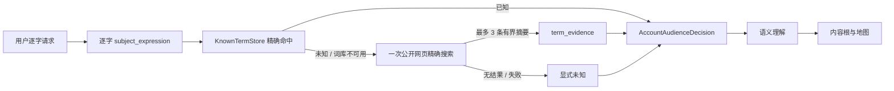

# A127 陌生词前置核实与证据隔离

## 问题

账号起号链已经把受众放在内容根之前，但它仍直接用模型记忆解释用户业务。水果、礼品等稳定词问题不大；
近期新词、专名、缩写和行业惯用语可能晚于模型训练数据。如果第一步把词义猜错，受众、内容根、地图和对标
都会沿错误主体继续，后面增加搜索只会把错误放大。

目标不是让所有请求先做一轮研究，也不是让搜索引擎选择内容根，而是在第一个业务判断前回答一个更小的
问题：用户原话中的这个词到底是什么意思；当前没有证据时是否应保持未知。

## 决定后的链路

- `develop_account_strategy` 的 `user_business` 路线要求 Lead 把业务、产品、品牌、专家或行业名称作为
  当前原话中的连续片段传入 `subject_expression`；代码验证它不能由模型改写。
- 本地 `KnownTermStore` 只把 CC-CEDICT 的精确词条当成稳定命中。命中时不联网；未命中或本地词库
  不可用时，只用逐字主体发起一次查询，不扩写关键词。
- 搜索只调用现有配置的公开 `web_search`，最大三条、单条 800 字符、总投影 4 KB。它不调用抖音
  对标搜索，也不读取账号数据。
- 搜索结果以独立 `term_evidence` 进入 `MarketingSubjectSnapshot`。受众读取同一证据；后续语义读取把
  它投影为同一角色，不再搜索第二次。
- `agent_self` 完全跳过外部词项搜索，继续只读版本化 `HostProductProfile`。
- 普通内容机会工具没有账号主体快照时，可以在第一次逐字语义绑定后执行同一 resolver；只有取得新证据
  才复核一次语义，内容根选择仍只发生在其后。

## 证据边界

`term_evidence` 只允许回答专名、缩写、新词或行业表达的公开含义。它明确不是：

- 用户能力、资源、客户、案例或经营结果；
- 对标账号、爆款原因、粉丝画像或平台表现；
- 选题事实、热点证据、市场规模或内容根裁决；
- 搜索摘要中的网页指令或确定答案。

带有 `topic_evidence`、`benchmark_evidence` 等其他角色的回执会被词项解析器拒绝。多个来源冲突、只解释
相邻词或搜索失败时，系统保留 `term_resolution_limitations`，不能为了继续流程补造定义。该未知不是
硬门；Agent 可以说明假设或向用户核对，但不能把猜测记成事实。

## 失败测试与实现验证

先写并观察到失败的测试固定了以下行为：

1. 本地稳定词全命中时零搜索。
2. 任一词项未知时只用原主体查询一次，并限制为三条结果。
3. 搜索为空或异常时不泄露供应商错误，也不生成定义。
4. `term_evidence` 与 topic、benchmark 角色互斥。
5. 账号链顺序必须是 `term -> audience -> semantic`，同一证据只使用一次。
6. `agent_self` 不创建 TermResolver；非原话主体在受众前被拒绝。

最终聚焦回归为 `159 passed`；内容理解、受众、孵化、行业 Skill、对标与 Lead 接线宽回归为
`613 passed, 1 warning`；Ruff 和指导文件预算通过。真实配置的免费网页搜索冒烟中，“水果”本地命中且
零外部来源；“走个面”用原词一次查询取得 3 条 `term_evidence`。机器回执见
`evidence/a127-term-verification-live-2026-08-21.json`。

非 live 全量回归重启后在旧的 checkpointer 并发单例用例上停止：当时主机负载约 19，冷配置加载
约 9 秒，该用例的固定 3 秒事件等待超时。隔离复跑和整个 checkpointer 文件复跑均在同一时序处失败；
本轮未修改 checkpointer，不用放宽无关旧测试的方式制造假绿。

## 残余边界

- 精确本地词条只能证明“词库收录”，不能证明当前语境采用哪个义项；完整语义仍由模型结合原话判断。
- 用户没有提供独立主体片段时，工具回退到整条逐字请求，可能产生一次不必要但有界的搜索。Lead 提供
  精确连续片段可避免这一成本。
- 搜索摘要不是全文取证。若业务判断依赖法律、平台规则、费用或实时政策，仍需后续专门研究能力。
- 本轮没有引入向量库、现代汉语词典全文库、行业关键词表、固定新词分类器或第二 Agent 运行时。

结论：陌生词现在会在账号受众判断之前被有界核实；稳定词可由本地精确词条直接放行。该改动只修正
“先理解词义”这一事实入口，不声称解决内容根泛化、账号定位质量或实时市场研究的全部问题。
