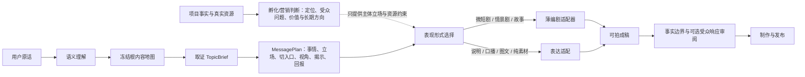

# A34 第四版营销与编剧能力迁移审计

## 状态

`discovered -> traced -> reviewed -> selective rewrite approved; runtime migration pending`

审计日期：2026-08-16。

本审计回答一个具体问题：第六版已经把语义、内容地图、取证选题和形式无关的可拍交付分开后，
第四版的营销方法与编剧方法能否迁入，以及应当挂在哪一层。结论是可以迁入能力，但不能迁入
第四版的控制结构，也不能把两类能力塞回内容地图。

## 来源与快照

- 只读来源：`/Users/yangyucheng/Documents/第四版营销系统`
- 分支：`codex/ip-agent-v1-final`
- 已提交快照：`58f4e0c900a2dc589fe4a23bdebbe8e3211b67b7`
- 未提交补丁 SHA-256：`b40c03fd97df59f3cda4559eeada9f8cddc8d065c001215b24596e0b757324dc`
- 审计时工作区存在 27 条状态记录；其中 Writer Brain、Lead、SOUL 和合同仍有未提交修改。
- 未提交代码只作为失败与演进证据，不作为直接迁移候选。

关键历史节点：

| 提交 | 历史含义 |
| --- | --- |
| `4a81930a` | 移除编排硬门堆栈 |
| `879221e1` | 移除业务语义硬门 |
| `1c87fd8a` | 隔离干净运行基线 |
| `fc61bde6` | 退役旧语义层 |
| `ba03d9ba` | 净化从对标到脚本的 Skill |
| `1aa2242b` | 重做 Writer Brain 决策架构 |
| `84ccb4dd` | 封存 Writer Brain v2 验收 |

这些提交说明第四版后期也在主动撤销“多个组件共同控制模型”的设计。第六版不应重新引入它
已经开始清理的东西。

## 观察到的真实边界

第四版最终产品台账将产品收敛为拆解、编剧脑、制作三块，但其默认 Agent 最终配置为
`skills: []`、`memory_enabled: false`，97 个公共 Skill 全部处于研究隔离。Skill 文件存在不等于
它们曾作为稳定生产能力运行。

`writer_brain.py` 共有 1137 行，`content_contracts.py` 共有 994 行。它同时承担故事生成、词项
黑名单、事实审查、版本绑定、幂等、事务提交与发布闸门。故事提示要求逐字出现“但、转而、
只能、代价是”，并由代码检查反馈、换招、选择和代价；Writer 又要求先存在
`EditorialProgramVersion`。这些设计适合解释第四版为何越来越僵，不适合直接进入第六版。

其中仍有三类值得保留的成熟经验：

1. 现实事实、外部证据、推断、假设和虚构必须分开。
2. 真正的故事需要人物目标、阻力、行动、反馈、策略变化、选择和结果，而不是把一般分歧叫冲突。
3. 内容、脚本、制作和发布需要不可变版本、哈希、幂等和回执，但这些可靠性机制不应替模型做创意判断。

## 逐项迁移矩阵

| 第四版来源 | 可保留能力 | 第六版落点 | 决定 |
| --- | --- | --- | --- |
| `ip-strategy-director` | 主体、受众处境、价值承诺、可信依据、长期内容供给、表现载体与商业路径的综合判断 | 独立的孵化/营销判断层，不进入语义或地图提示 | 薄改重写 |
| `design-ip-differentiation` | 从主体独有事实形成可归因、可修正的差异化假设 | 项目级定位版本；只给下游一个有界立场投影 | 薄改重写 |
| `engineer-audience-response` | 注意、理解、情绪、分享、关注/收藏/行动的可观察假设 | 成稿后的可选响应审阅，不改 TopicBrief 的事实与观点 | 薄改重写 |
| `ip-content-calibration` | 预测、发布观察、复盘与修正 | Publication/Observation 之后的学习层 | 延后采用 |
| 八个平台诊断 Skill | 平台字段、证据类型、账号诊断问题 | 账号证据与平台适配器，不参与内容根裁决 | 薄适配 |
| `develop-theme-premise` | 主题问题、正题/反题和可持续前提 | 长期系列请求的可选方法，不是每条内容必经步骤 | 选择性吸收 |
| `engineer-plot-information` | 目标、行动、反馈、换招、选择、后果与信息顺序 | 叙事形式下的故事适配器 | 选择性吸收 |
| `write-ip-episode` | 单集事件闭环、动作节拍、人物变化和可拍性 | 叙事形式下的单集适配器 | 选择性吸收 |
| `write-scenes-dialogue` | 场景目标、阻力、策略、转向、潜台词与离场变化 | 已选择情景剧/微短剧后才调用 | 选择性吸收 |
| `writer_brain.py` | 事实边界、真相模式、版本与幂等经验 | 拆成小合同，复用第六版现有 Evidence/TopicBrief 谱系 | 拒绝整文件迁移 |
| `content_contracts.py` | `claim_basis`、事实/虚构边界和版本谱系概念 | 映射到现有证据引用和后续 DraftVersion | 拒绝单体合同迁移 |
| `personal-ip-operator`、旧 SOUL、旧中间件 | 总控、固定流程、必填状态和工具编排 | 无 | 拒绝 |
| 电影化 IP 全套矩阵 | 影视专业工种与长期世界观 | 未来用户明确要求高制作叙事时按需加载 | 不进入默认起号链 |

## 第六版目标架构

最重要的所有权约束：

- 孵化/营销判断可以决定账号长期占领什么、以谁为载体、替什么人解决什么问题，但不能改写已经冻结的词义、内容根或来源事实。
- 内容地图只发现可讲的世界，不决定口播、短剧或成交方式。
- 表现形式选择发生在 `MessagePlan` 之后，结合主体真实表达能力、资源、隐私、持续产能和本条内容性质。
- 编剧适配器只有在叙事形式被选择时才运行。说明、比较、历史梳理和知识答疑无需强行套故事。
- 编剧适配器可以组织虚构情节，但必须显式标注真相模式；它不能把虚构人物冒充客户案例，也不能重新选择选题。
- 受众响应审阅只能提出改写建议，不能编造完播率、转化率、发布时间、条数或实验周期。

## 最小合同，而非新的一坨流程

后续实现最多新增三个薄合同：

1. `IncubationJudgment`：账号级判断，保存主体、目标受众问题、价值承诺、信任依据、长期内容方向、商业假设、未知和替代方向。
2. `FormatDecision`：只选择本条内容采用说明、口播、图文、纯素材、访谈、微短剧或情景剧，并说明选择依据与资源要求；不得改写 TopicBrief。
3. `StoryDraft`：只在叙事形式下读取冻结的 `MessagePlan`、可选 `NarrativeFrame` 和证据边界，输出人物目标、阻力、行动变化与可拍场景。

它们都允许为空，也都不是必须按顺序填满的工作流。Lead 根据当前请求调用需要的能力；没有叙事需求
时不加载编剧方法，没有账号战略问题时不加载完整营销方法。

## 迁移前失败测试

1. 黄金礼品进入“礼与人与人相处”后，事实型历史选题必须绕过编剧适配器；不得为完整感补造人物冲突。
2. 牡蛎与《我的叔叔于勒》可使用原作中的人物行动链，但改编不得把文本解释写成原作明示事实。
3. 同一个 TopicBrief 选择口播与微短剧时可以得到不同形式，但主体、事情、立场、观点和证据引用必须一致。
4. 编剧适配器不得把商品、流量、成交或拍摄行为写成人物的必然目标，也不得用关键词黑名单误伤合法商业故事。
5. 营销判断缺少履历、客户、数据时仍可给带假设的临时方向，不得要求先完成一套问卷或 Program 才能写。
6. 任一方法不得自动补造固定候选数、视频条数、天数、比例、预算或成功阈值。
7. 非叙事题材不调用故事模型；叙事调用失败时回到已验证的 `BaseDraft`，不能破坏语义、地图和 TopicBrief。

## 当前结论

现在正是迁移第四版能力的正确时点，但迁移单位必须是“小方法 + 小合同 + 可归因测试”，不是
Skill 数量、提示词长度或旧代码目录。首个实现应只比较一个薄 `FormatDecision` 与一个薄叙事适配器；
营销孵化层另开项目级合同，不与当前阅读理解链同时重构。只有新保留集证明质量提升，才登记运行时采用。
