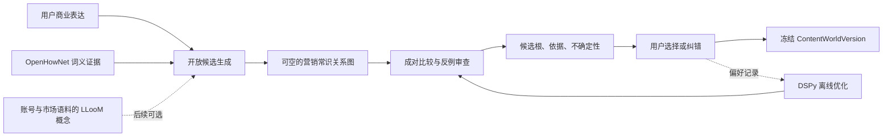

# A83 内容根泛化现成方案与采用边界审计

## 审计状态

- 日期：2026-08-18
- 代码基线：`601b76d0`
- 状态：`reviewed; research architecture selected; runtime unchanged`
- 范围：商业表达如何泛化为长期内容世界、是否需要知识库、如何把人工纠错变成可复用数据
- 非范围：账号路线、具体选题、文案、制作、发布和复盘

## 用户问题

当前内容根在黄金礼品、水果店等案例上多次出现“修这里、坏那里”。用户因此追问：

1. 是否存在可以直接解决“我是做什么的 -> 该长期讲什么”的现成方案？
2. 是否必须逐条人工标注？
3. 内容根是否应该改成向量知识库？

本轮横向检索了大厂生产系统、知识图谱与意图理解论文、中文词义资源、概念归纳、自动提示优化、
合成数据与人工反馈工具，以及现有营销 Agent。

## 结论

没有发现一个能够直接安装后完成“中文商业表达 -> 最大有效营销内容世界”的开源成品。现有营销
Agent 普遍假定定位、目标受众或内容支柱已经给定，从写稿、审批或发布开始，恰好跳过了本项目最难的
内容根判断。

但存在一条已经被多家大厂和研究系统分别验证的组合路线：

> **需求/意图概念图谱生成候选 + 少量人工偏好校准 + 学习型排序器选择内容根 + 运行时保留不确定性。**

这比继续堆提示词补丁更可靠，也不等于先建设一个通用向量库。最接近本项目问题的生产先例是阿里
AliCoCo 与亚马逊 COSMO/FolkScope：它们都发现商品类目和属性无法表达“人为什么需要、会在什么场景
使用、与哪些人和活动有关”，因此在商品之上增加用户需求、意图、活动和常识关系。

第六版应借用这套结构，但目标不是推荐商品，而是选择一个可长期展开、又能返回商业对象的内容世界。

## 一、大厂生产先例

### 1. AliCoCo：从商品类目跳到用户需求概念

[AliCoCo](https://arxiv.org/abs/2003.13230) 指出传统电商的“类目-属性-属性值”只能组织商品，无法表示
“户外烧烤”“给孩子保暖”“给爷爷的圣诞礼物”等真实需求。其四层结构包含商品、类目/属性、原子概念
和电商需求概念，并通过半自动挖掘、人工审核和模型学习持续扩展。阿里的公开仓库
[alicogintel/AliCoCo](https://github.com/alicogintel/AliCoCo) 主要提供论文索引，没有可直接嵌入的生产代码
或数据。

对第六版的启发：

- “黄金礼品”不能只停在黄金材质和礼品类目，应允许连接到赠予、礼、关系维护、身份与社会秩序。
- “水果店”应区分经营容器和被服务对象，水果可以继续连接品种、产地、季节、驯化与饮食文化。
- 需求概念层是商品与人的世界之间的桥，不是一个关键词近邻列表。

### 2. FolkScope/COSMO：让模型提出关系，人和模型共同过滤

[FolkScope](https://aclanthology.org/2023.findings-acl.76/) 使用 LLM 根据搜索、购买和共购行为生成开放意图
或关系断言，再由人工标注“合理性”和“典型性”，训练分类器把少量人工判断扩展到大批候选。其
[开源仓库](https://github.com/HKUST-KnowComp/FolkScope) 为 MIT 许可，包含代码和数据入口，但依赖较旧，
完整模式挖掘提示需要超过 100 GB 内存，不适合整包迁入第六版。

亚马逊后续生产系统 [COSMO](https://www.amazon.science/blog/building-commonsense-knowledge-graphs-to-aid-product-recommendation)
把方法扩展到 `used_for_function`、`used_for_event`、`used_for_audience` 等更细关系。它的循环是：

```text
真实行为
-> LLM 生成关系假设
-> 规则与相似度去噪
-> 人工判断合理性与典型性
-> 分类器筛选
-> 从高质量样本提炼指导原则
-> 再生成和复核
```

这与用户当前的纠错过程高度同构：用户不是在为每个行业写答案，而是在判断哪个语义跃迁合理、典型，
以及哪些近邻虽然相关但太窄。

### 3. 已知风险：关系类别不能变成新的硬门

[Usage-Centric Intent Understanding](https://arxiv.org/abs/2402.14901) 对 FolkScope 的后续评测指出，固定
类别会出现“类别僵化”和“属性歧义”。这与第四版失败史一致：如果把所有商业对象强迫经过同一组关系，
知识图谱也会变成另一套硬门。

因此第六版只能把关系作为**可空、可审阅的候选边**，不能规定“产品必须先到用途、用途必须再到人性”
之类的固定路线。水果、海鲜、雪茄等完整对象可以直接成为内容世界；黄金礼品则可能通过礼和社会实践
形成更大的世界。

## 二、开源组件适配度

### 1. DSPy：最适合先采用的离线优化器

[DSPy](https://github.com/stanfordnlp/dspy) 是 MIT 许可的模型程序与提示优化框架。它不是替换 DeerFlow
的第二 Agent 运行时，而是根据固定评测指标和样本，离线搜索更好的指令和示例组合。其
[优化器文档](https://github.com/stanfordnlp/dspy/blob/main/docs/docs/learn/optimization/optimizers.md) 提供：

- `BootstrapFewShot`：从少量通过样本生成有效示例；
- `MIPROv2`：联合搜索指令和示例；
- `SIMBA`：针对高波动困难样本生成改进规则；
- `GEPA`：利用运行轨迹和文字反馈反思并演化提示；
- `BootstrapFinetune`：数据足够后再把方法蒸馏进小模型。

适配结论：**采用为隔离实验工具，不进入线上 Lead。** 它可以把“手改提示词”升级为“冻结评测后自动
搜索候选提示”，最终只导出一份可审阅、可回滚的提示/示例工件给现有 DeerFlow 运行时。

### 2. OpenHowNet：适合做中文结构化词义证据

[OpenHowNet](https://github.com/thunlp/OpenHowNet) 提供中英文词义、义原树、词性和词义关系。API 为
MIT 许可，数据使用还须遵守其网站条款。它比把现代汉语词典切块后做向量相似更适合回答：一个词在
复合词中承担的是材质、对象、动作、功能、角色还是社会关系。

适配结论：**仅做候选证据实验。** 它可以帮助拆词和消歧，不能替模型决定最大内容世界，也不能因
词义库缺失就拒绝继续。

### 3. LLooM：适合从账号语料中归纳高层概念

斯坦福 [LLooM](https://stanfordhci.github.io/lloom/about/) 是 BSD-3-Clause 的概念归纳研究原型。它从
社交帖子、文章等一批非结构化文本中，逐层生成带明确纳入标准的高层概念，避免传统聚类只输出关键词。

适配结论：**适合以后处理对标账号、自有账号、评论和素材语料，不适合单句首次起号。** 当抖音账号
采集和 MediaKit 已形成一批真实文本时，LLooM 可以归纳“这个赛道实际上长期在讲哪些世界”，再作为
内容根候选证据；它不能独自判断“我是做黄金礼品的”这一句。

### 4. Distilabel 与 Argilla：可借用数据飞轮，不急着部署

[Distilabel](https://github.com/argilla-io/distilabel) 支持合成数据和 AI 反馈流水线，Apache-2.0；但原作者
已转向其他项目，目前由社区维护。[Argilla](https://github.com/argilla-io/argilla) 支持偏好排序、人工反馈、
过滤和语义搜索，Apache-2.0，当前以稳定维护和修复为主。

适配结论：先借它们的数据合同和审阅方式，在 DeerFlow 现有前端做一张轻量“哪一个更像长期内容根”
确认卡。没有必要为了少量样本立即再部署一套服务。

### 5. Agent Lightning：有真实结果以后再考虑

微软 [Agent Lightning](https://github.com/microsoft/agent-lightning) 可以在不重写 Agent 的前提下采集轨迹，
用强化学习、提示优化或微调更新 Agent，MIT 许可。它适合有稳定任务奖励和大量运行轨迹后的完整学习
循环。

适配结论：当前内容根尚无可靠奖励，只有少量人工纠错。现在接入会把错误裁判放大成训练信号；先用
DSPy 做可控离线优化，等发布结果、账号增长和人工偏好都能稳定归因后再评估 Agent Lightning。

## 三、为何现有营销 Agent 不能直接解决

[LangChain Social Media Agent](https://github.com/langchain-ai/social-media-agent) 的输入是 URL 和已经写好
的 `BUSINESS_CONTEXT`、示例与内容规则，目标是生成和审批社交帖子。微软
[Agentic Marketing Content Generation](https://github.com/microsoft/Agent-Framework-Samples/blob/main/09.Cases/AgenticMarketingContentGen/README.md)
及 [Content Generation Accelerator](https://github.com/microsoft/content-generation-solution-accelerator)
也以创意简报、目标受众、痛点、卖点或品牌资料为起点。

这些项目可以参考下游写作、审批和多模态协作，但不能回答“业务对象背后哪个世界值得长期讲”。把它们
整包接入只会提前进入写稿，再次绕过内容根。

## 四、不采用普通向量知识库作为核心

向量检索回答的是“什么文本与黄金礼品相似”，容易召回黄金、珠宝、水贝、婚礼、三金和礼品营销；
而本项目需要比较的是：

- 哪个候选仍能解释原商业对象；
- 哪个候选比其他候选拥有更大的真实人物、时间、空间、事件和文化容量；
- 哪个候选不是经营动作、单一场景或产品介绍；
- 哪个候选可以脱离商品字面持续讲述，同时仍有清楚的返回路径。

这是关系推理和偏好排序，不是相似度检索。向量检索以后仍可用于寻找已确认案例、证据和反例，但不能
拥有根裁决权。

## 五、建议的第六版研究架构

本轮只批准一个隔离的 `ContentRootLab` 研究架构，不修改现役运行时：



### 候选图只表达关系，不规定路线

候选边可包括：

```text
is_a / part_of / made_of
used_for_function / used_for_event / used_by_audience
occurs_in_time / occurs_in_place
participates_in_practice / organizes_relationship
symbolizes / evokes / leads_to_result
evidenced_by / contradicted_by
```

任何边都允许缺失。模型也可以提出新的自然语言关系；只有在多案例中稳定复现后，才考虑归一成共享
关系。图负责保留“为什么能从 A 到 B”，不负责用固定枚举压平所有行业。

### 运行时只做可审阅的相对选择

内容根选择器不再企图一次生成绝对标准答案，而是比较候选：

```text
黄金知识 vs 婚礼馈赠 vs 礼如何组织人与人相处
水果店交易 vs 水果世界 vs 健康饮食
重庆饮食 vs 火锅世界 vs 调味料工艺
```

选择记录必须保存偏好、可接受备选、拒绝原因、未知和来源。用户的一次纠错因此可以迁移为关系偏好，
而不是“黄金礼品 -> 人情世故”的行业关键词规则。

## 六、人工标注如何减负

完全零人工不现实，因为“哪个世界值得一个 IP 长期占领”包含业务价值判断，不只是词典事实；但不需要
逐行业写标准答案。

最低人工工作应变成成对选择和原因确认：

```text
输入：我是做黄金礼品的
候选 A：黄金知识
候选 B：婚礼馈赠
候选 C：礼如何组织人与人相处
用户：C 优于 B，B 优于 A；B 太窄，A 误把材质当主语
```

系统随后自动生成不含隐藏答案的结构变体和难反例，例如材质替换、经营容器替换、修饰语删除、近邻
窄场景和错误抽象，再只把模型分歧大、置信不足或新关系的样本交给人。ACL 的
[组合泛化研究](https://aclanthology.org/2023.acl-long.78/) 还表明，只取最相似案例并不足以泛化；示例集
应覆盖多种结构，而不是给黄金案例找一堆黄金近邻。

## 七、采用矩阵

| 方案 | 能解决什么 | 第六版决定 |
| --- | --- | --- |
| AliCoCo | 商品到用户需求概念的分层结构 | 采用架构思想，不迁仓库 |
| COSMO/FolkScope | 开放关系生成、合理性/典型性标注、模型筛选 | 采用方法与数据合同；FolkScope 不整包迁入 |
| Usage-Centric benchmark | 暴露固定关系类别僵化 | 采用为反例设计原则 |
| DSPy | 根据冻结评测自动优化指令和示例 | 下一阶段隔离实验首选 |
| OpenHowNet | 中文拆词、义原和关系证据 | 薄适配实验，不拥有根裁决权 |
| LLooM | 从大批账号文本归纳高层概念 | 对标/账号语料就绪后实验 |
| Distilabel/Argilla | 合成数据、AI 反馈、人工偏好 UI | 借合同，暂不部署第二服务 |
| Agent Lightning | 用真实轨迹和奖励训练 Agent | 延后到奖励可靠且样本足够 |
| 普通向量 RAG | 找相似案例和证据 | 仅辅助检索，拒绝作为内容根内核 |
| 现有营销 Agent | 写稿、审批、发布 | 只参考下游，不用于根判断 |

## 八、下一次实验边界

下一步不是把上述组件同时接进生产，而是先写一份新的预注册对比：

1. 冻结当前 `601b76d0` 为现役基线，不继续在其提示词上追加案例补丁。
2. 用现有用户纠错制作**开发偏好种子**，另建从未用于调参的留出行业与结构。
3. 比较“现役基线”“开放关系候选图”“候选图 + DSPy 离线优化选择器”。
4. OpenHowNet 单独作为可开关证据臂，验证它是否提高消歧而不制造词义噪声。
5. 评测候选召回、最终根人工偏好、内容地图是否忠于冻结根、事实越界、成本和延迟。
6. 只有留出集通过后，才签署新 ADR 并替换现役根选择；优化器、训练数据和实验轨迹不得进入 Lead。

LLooM、Argilla、Distilabel、Agent Lightning 和微调均不进入第一轮。这样一次只验证一个关键假设：
**显式关系候选加学习型偏好排序，能否比持续手改提示词更好地泛化。**

## 最终判断

这次搜索证明用户提出的问题不是孤例，也不是模型“多联想一下”就能稳定解决。阿里和亚马逊都把“商品
属性无法抵达人的需求和场景”当作独立知识层来建设，并且都依赖半自动生成、人工校准和模型学习。

第六版不应建设一个装满词典切片的向量库，也不应继续积累行业 if/else。应建设的是一张小而可增长的
**营销意图/内容世界关系图**和一套**成对偏好数据**；模型负责开放联想，结构化证据负责说明路径，
离线优化器负责从纠错中学习，用户保留首次选择权。当前只完成方案审计，生产代码保持不变。
