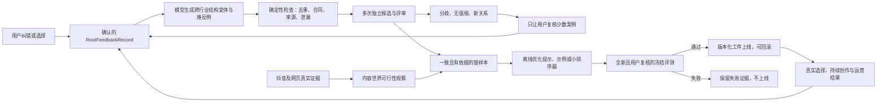

# A96 内容根自举闭环研究

## 状态

- 本地日期：2026-08-19
- 状态：`reviewed -> research design proposed; runtime unchanged`
- 问题：如何让内容根能力从少量用户纠错中持续进步，而不是逐行业手工标注或继续修改核心提示词
- 前置证据：A83-A95
- 非范围：现役 Lead 接入、自动改提示词、在线训练、小模型微调和发布结果奖励

## 核心结论

内容根可以自举，但不能让同一个模型同时负责生成答案、判定正确和修改自己。可行的自举是：

> **模型扩大候选与样本，用户纠错、独立证据和真实结果提供外部真值；系统只把经过筛选的经验离线编译成
> 新版本，再用从未见过的用户复核案例决定是否晋级。**

这不是零人工，而是把人工从“逐行业写标准答案”压缩为“只处理分歧、未知和新关系”。用户教的是判断方式
和适用条件，不是行业关键词表。

## 研究对照

- [Self-Instruct](https://aclanthology.org/2023.acl-long.754/) 证明模型可以从少量种子大量生成训练任务，
  但生成结果必须经过无效项和重复项过滤。
- [STaR](https://arxiv.org/abs/2203.14465) 的自举循环也依赖已知正确答案，只保留能够导向正确答案的推理。
- [Divide-Verify-Refine](https://aclanthology.org/2025.findings-acl.709/) 发现模型自身反馈并不可靠，有效修正
  依赖外部工具或经过验证的动态示例库。
- [DSPy 优化器](https://github.com/stanfordnlp/dspy/blob/main/docs/docs/learn/optimization/optimizers.md) 可以
  自动搜索指令和示例，但优化质量由训练样本与评测指标决定；A84 已实证，错误或稀疏偏好会发生负迁移。
- 亚马逊 [COSMO](https://www.amazon.science/blog/building-commonsense-knowledge-graphs-to-aid-product-recommendation)
  用真实行为、LLM 候选、人工合理性/典型性判断和模型筛选共同扩展商品常识关系。
- 2026 年 EACL 的[人类标注分歧研究](https://aclanthology.org/2026.eacl-long.3/)提示，主观任务中的不同意见
  本身是信息，不能让推理模型把它们强行压成一个假标准答案。

## A84 为什么不算真正自举

A84 已经试过“关系候选图 + 七条人工偏好 + DSPy”，但它在四题上只达到人工 `2/4`：修正羽毛球馆的同时，
把儿童出行安全扩大错成儿童成长发育。它的问题不是 DSPy 不能用，而是：

1. 七条偏好尚未覆盖足够多的语义结构，就被直接编译进选择器。
2. 评测默认每题有一个开发者写好的唯一答案，没有先让用户复核标签。
3. 候选召回错误、最终选择错误、IP 可行性错误和评测标签错误混在一个分数里。
4. 没有“无强根 / 条件成立 / 不适合独立 IP”的合法答案。
5. 没有主动学习队列，系统不会把最值得人工判断的少数案例挑出来。

因此，新方案不是在 A84 上增加提示、角色或搜索，而是替换其数据形成方式。

## 四类错误必须分账

每次失败先归入一个或多个独立问题，不能笼统记为“模型不聪明”：

| 错误 | 例子 | 应该改什么 |
| --- | --- | --- |
| 候选召回错误 | 房车只到房车生活，没有独立召回旅行 | 候选生成 |
| 候选选择错误 | 已有水果，却选择门店买卖 | 比较与收敛 |
| IP 可行性错误 | 强迫老年助听器一定长成独立 IP | 可空结论与成立条件 |
| 评测标签错误 | 把自驾旅行当成房车案例唯一更大世界 | 标注协议与人工复核 |

只有知道错误发生在哪一层，纠错数据才可能迁移；否则自动优化只会继续修一处、坏一处。

## 自举数据的最小单位

不保存“黄金礼品 = 人情世故”这种行业规则。每次显式纠错保存一条追加式 `RootFeedbackRecord`：

```text
用户原话
商业对象
本轮候选
用户认为最佳 / 可接受 / 拒绝 / 无强根
选择原因与拒绝原因
适用条件与未知
IP 可行性：强 / 条件成立 / 弱 / 未知
模型、提示、证据和父版本
状态：proposed / confirmed / contested / superseded / retired
```

例如房车纠错表达的是“载体附近的活动不应遮住更大的旅行世界”；助听器纠错表达的是“功能相关不等于
最佳营销世界，并且语义可关联不等于该经营者有条件做 IP”。两条都不是可以无条件套用到所有行业的规则。

## 自举循环



### 1. 从金样本生成变体，不生成真理

模型可以自动构造载体替换、经营容器替换、材质与用途交换、完整对象、词汇化名称和弱 IP 等结构变体。
它只负责提出待判断案例和候选，不能给自己生成的答案盖章。

### 2. 自动过滤容易验证的部分

代码可以验证合同、候选重复、商业对象原样复读、具体选题冒充内容根、证据身份、数据泄漏和版本谱系。
这些检查不判断“旅行是否比房车生活更值得长期讲”。营销判断仍由用户确认数据和经过校准的模型评审承担。

### 3. 用分歧驱动人工，而不是随机抽题

以下情况进入用户复核队列：

- 多次独立生成或评审选择不同候选；
- 最优候选与次优候选差异很小；
- 出现从未确认过的新关系；
- 所有候选都弱，可能不适合独立 IP；
- 候选成立依赖用户身份、能力、资源或授权事实。

用户界面只需展示少量候选，并允许“最佳、也可以、不合适、都不适合做 IP”。自然语言理由可选；用户像
A94-A95 这样主动解释时，系统再保存更高价值的条件化纠错。

### 4. 抖音证据只验证可生长性

对候选“旅行、房车生活、自驾游”或“孝亲敬老、听力健康”分别调用已授权的抖音 OpenAPI，观察是否存在
跨人物、时间、空间、事件和表现形式的真实内容，以及是否只有少数重复卖货视频。对标账号与普通资料继续
分账。

搜索热度、播放量或账号数量不能证明语义答案正确，也不能自动选择内容根。它们只回答：这个候选在真实平台
上是否具有内容容量、是否过度同质化、有哪些成立条件和反例。

### 5. 离线学习，版本化晋级

积累到覆盖不同错误类型的确认数据后，再比较：

- 动态选择少量结构不同的确认案例；
- DSPy `BootstrapFewShot` 或后续优化器；
- 数据充分后训练一个只做候选排序与可行性判断的小模型。

优化器永远不在线修改核心提示。它只能导出带数据哈希、评测回执和父版本的候选工件；通过全新冻结集后
才能替换上一版，一旦退化可以立即回滚。

### 6. 真实结果是慢信号，不是即时奖励

用户最终采用哪条账号路线、能否持续产出、内容是否形成系列、受众是否稳定、商业承接是否成立，都会成为
后续证据。但一条视频播放高不能证明内容根正确，平台流量也不能直接回写提示。真实结果先形成可争议的
`LearningClaim`，跨多条内容和更长窗口复现后才提高权重。

## 单 Agent 与自举不冲突

线上仍由一个 Lead 拥有营销判断权。候选批量生成、多次采样、证据采集、离线评测和提示优化属于后台数据
生产，不是面向用户的多个决策 Agent。这样既保留单智能体的连贯判断，也可以在离线阶段用并行计算降低
标注成本。

## 建议的实施顺序

1. 先建立追加式 `RootFeedbackRecord` 和四类错误标签，不修改现役内容根提示。
2. 把用户已经明确纠正的案例整理成有条件的种子，不把 A92 开发者隐藏答案继续冒充金标。
3. 做一张最小确认卡，支持最佳、可接受、拒绝和无强根；只把分歧案例送给用户。
4. 建立隔离合成器与确定性过滤器，生成跨行业结构变体和反例。
5. 抖音证据只作为候选可生长性观察，不能取得根裁决权。
6. 有足够覆盖后再预注册新的离线优化对比，并使用全新、用户复核且允许多答案的留出集。

## 验收边界

自举成功不是“系统以后再也不问人”，而是同时满足：

- 新行业中需要用户纠正的比例持续下降；
- 纠正集中在真正有分歧或信息不足的案例；
- 不因加入一个案例而让既有结构大面积退化；
- 能主动承认无强根、条件成立和多种有效答案；
- 每次晋级都有冻结评测、版本、证据和回滚路径；
- 未确认的模型合成数据、单条爆款和平台热度永远不能自动变成营销规则。

因此，第六版最应该先建设的不是新知识库或新提示，而是**可积累的纠错数据合同、主动复核队列和离线晋级
机制**。这三者才是内容根真正开始自举的起点。
