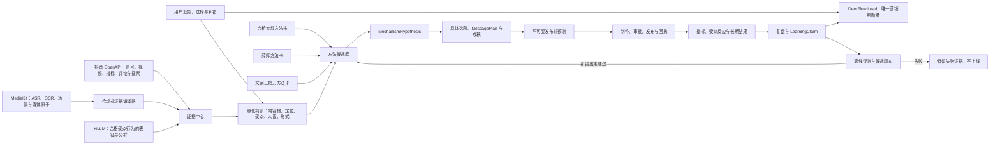

# A97 Skill、平台证据与自进化系统编排审计

## 问题

第五版及旧版已有仓颉适配思路、金枪大叔、薛辉小清新、文案三把刀等方法资料；第六版又已有抖音
OpenAPI/MCP、MediaKit 和 HLLM 边界。它们能否组合成一套会随真实运营不断进步的系统，而不是继续
依靠人工改长提示词？

## 核心结论

可以，而且它们正好覆盖自进化所需的不同部位，但目前还只是**架构上可闭环、实现成熟度不一致**：

> 抖音提供平台观察，MediaKit 提供视频时序观察，仓颉适配负责把材料编译成可追溯证据，创作者方法卡
> 提出可检验的创意机制，Lead 作最终营销判断，发布后的真实结果和用户纠错形成学习记录；HLLM 在取得
> 合格的逐受众行为序列后补充群体表征。

这里的“自进化”不是运行中自动改核心提示词、改 Skill 或把爆款当真理，而是：

1. 每次判断、采用的方法、发布前预测和实际结果都有版本与来源；
2. 系统从结果中形成可争议的学习结论；
3. 重复成立的方法才进入离线候选版本；
4. 新版本必须通过未见案例和人工复核后才能晋级，并可随时回滚。

## 现有能力盘点

| 能力 | 已有资产与当前状态 | 在闭环中的职责 | 不拥有的权力 |
| --- | --- | --- | --- |
| 仓颉适配 | 第四版 `video-method-distillation` 与 `video-pattern-learning`；第五版 A33/E15 已完成隔离验证 | 将完整来源、多视频模式、反例、时间戳和限制整理为证据包 | 不自动安装 Skill，不判定账号为什么火，不决定用户照抄什么 |
| 金枪大叔 | 已蒸馏进个人 IP 创作者方法图谱，证据等级混合 | 提出价值位置、借势、个人品牌和“语言钉子/视觉锤子”等机制候选 | 不替代内容根，不把书名、观点或名气当效果证明 |
| 薛辉小清新 | 已蒸馏进方法图谱，部分来自可核实公开片段 | 提出诊断型入口、反向演示、显眼差异和单变量测试候选 | 不把“爆款元素”升级为固定公式，不要求每条内容套钩子 |
| 文案三把刀 | 已蒸馏进方法图谱，包含平台迁移与文案任务假设 | 提出平台适配、流量/信任/咨询/购买等首要任务和 A/B 候选 | 不把个人经验写成永久平台规则，不越过内容判断直接卖货 |
| 抖音 OpenAPI/MCP | 119 项目录已建立渐进披露；公开视频搜索与项目证据谱系已有实现，真实凭据验收仍待完成 | 搜选题资料、发现对标候选、取得平台指标与后续发布回执 | 热度、播放量和账号数量不裁决内容根，也不证明因果 |
| MediaKit | 本地元信息与受控输入输出已验收，首个本地剪辑切片已通过；广义云能力仍待验收 | ASR、OCR、场景、视频原子证据、后续制作与质检 | 不理解账号定位，不判定爆款原因，不制定营销方案 |
| HLLM | 请求、伪名化、回执和边界合同已实现；真实权重服务、多 actor 聚合与中文留出评测未完成 | 从合格的逐受众行为序列产生表征或分群，帮助发现受众差异 | 不是采集器；账号作品史不能冒充受众行为；单 actor 不能冒充粉丝画像 |
| DeerFlow Lead | 现役单总脑、项目谱系、工具、MCP、Skill、持久运行与子任务能力 | 读取有界证据，选择内容根、账号路线、选题、表现形式和方法组合 | 不得把模型自评、单次结果或外部网页文字直接提升为规则 |

因此，这不是把七样东西串成一条固定流水线。它们应该成为一套**按任务调用、通过共同数据对象协作**的
系统。

## 总体结构



## 三个相互连接的飞轮

### 1. 语义与孵化飞轮

用户说“我是做什么的”，系统提出多个内容根、账号路线和成立条件；用户选择、拒绝或纠错后，写入 A96
定义的 `RootFeedbackRecord`。模型可以从确认记录生成跨行业变体，但不能给自己的答案盖章。

这个飞轮解决：

- 系统能否越来越准确地理解用户业务；
- 哪个内容世界值得长期讲；
- 什么时候应该承认品类本身很难独立做 IP；
- 用户偏好哪种账号方向和表现形式。

### 2. 对标与创意机制飞轮

抖音取得账号、作品、指标和互动观察，MediaKit 将视频拆成带时间戳的语音、画面文字和场景证据，仓颉式
编译器再形成 `AccountEvidencePack`：观察、功能、解释、适配变量、不可复制资产、重复模式、反例和覆盖
缺口必须分开。

金枪大叔、薛辉和文案三把刀的方法卡只读取这个证据包，并提出 `MechanismHypothesis`，例如：

- 这条内容是否适合用“语言钉子 + 可见证据”表达；
- 是否适合把讲解改成一个有真实停止条件的反向测试；
- 这一条的首要任务是停留、信任还是咨询；
- 同一主张在抖音上应改变哪个适配变量。

每个假设必须记录适用条件、反例、来源证据、不可复制边界、预期变化和替代方案。Lead 可采用、修改或
拒绝，方法卡不投票决定最终方案。

### 3. 受众与结果飞轮

发布前冻结“这条内容针对谁、为什么可能有效、预期改变什么”；发布后绑定抖音第一方回执、指标、评论与
其他受众观察。确定性分析负责基线、分布、异常和版本对齐，Lead 负责解释。

HLLM 只有在同一伪名受众拥有合格行为序列时才加入这一飞轮。它的单人表征需要经过多 actor 聚合、覆盖率、
稳定性和反例校验，才能形成 `inferred audience evidence`。没有真实权重回执时，HLLM 不参与线上判断。

## 共同数据对象

模块之间不能靠聊天记忆互相传话，最小追加式谱系为：

```text
IPProject
-> RootFeedbackRecord / IncubationJudgment
-> EvidenceSnapshot / AccountEvidencePack / BenchmarkSnapshot
-> MechanismHypothesis
-> TopicBrief / MessagePlan / DraftVersion
-> PreflightPrediction
-> PublicationReceipt / MetricSnapshot / AudienceEvidence
-> Retrospective / LearningClaim
-> MethodCandidateVersion / EvaluationReceipt
```

`MechanismHypothesis` 至少包含：

```text
method_id + method_version
target_project + target_content
mechanism_claim
applicable_conditions
supporting_evidence_refs + counterexample_refs
adaptation_variables + non_copy_boundaries
preflight_prediction
status: proposed / selected / tested / replicated / contested / retired
```

## 经验晋级规则

一条方法从“看起来有用”变成系统经验，至少经过以下过程：

1. **提出**：方法卡依据当前项目和证据提出机制假设。
2. **选择**：Lead 或用户选择它，未选择的候选也保留，不能改写历史。
3. **预演**：在发布前写清可观察预测、替代解释和不成立条件。
4. **验证**：发布回执、指标、评论、受众和长期承接与精确版本绑定。
5. **复盘**：区分“内容本身”“表现形式”“平台分发”“人设信任”和外部事件，形成可争议结论。
6. **复现**：跨多条内容、时间窗口或相似条件重复成立，才成为 `replicated`。
7. **晋级**：离线生成新方法工件，经全新冻结评测和人工抽查通过后版本化上线。

单条爆款、一次高转化、方法作者的名气、模型自评分、平台热度和无来源的“爆款原因”都不能触发自动晋级。

## 为什么这比“把 Skill 全接上”更重要

把多个 Skill 同时塞进上下文，会再次出现第四版的问题：每套方法都要求模型完成自己的任务，最后内容根、
钩子、成交、平台规则和实验配额一起争夺注意力。正确用法是：

- Skill 按当前决策需要即时读取，不常驻核心提示；
- 同一轮只选择少量相关方法候选；
- 方法输出是结构化假设，不是对 Lead 的命令；
- 确定性代码管理来源、哈希、版本、身份、统计与状态；
- 只有 Lead 对用户给出一个统一判断。

## 当前缺口与实施顺序

1. 将 `video-pattern-learning` 的五层证据语义薄迁入第六版证据编译边界；不迁移仓颉旧编译器、自动安装
   和固定样本数量规则。
2. 将创作者图谱拆成小型、版本化的方法卡，保留 `sourced_fact / cross_source_synthesis /
   analyst_inference` 证据等级；不把全图谱注入 Lead。
3. 实现 `MechanismHypothesis`、选择记录和预演/结果绑定；先用已有历史案例跑离线闭环。
4. 完成抖音公开搜索真实凭据验收，再让对标证据进入 `AccountEvidencePack`；普通选题资料与对标资料继续
   使用不同角色。
5. 接入 MediaKit 的 ASR/OCR/场景感知垂直切片并做人工误差核对，输出只进入证据中心。
6. HLLM 后置：取得真实逐受众行为、权重服务和多 actor 聚合验收后再接，不作为当前自进化的依赖。
7. 数据覆盖足够后，再比较 DSPy、动态示例选择或小排序器；任何优化只离线导出候选版本。

## 最终判定

这组资产能够组成一套自进化的新媒体运营系统，且比单独打磨内容根更完整：内容根从用户纠错中学习，创意
方法从真实作品实验中学习，受众判断从平台观察与长期行为中学习。

但截至本审计，它还不是已运行的自进化系统。仓颉适配仍是隔离资产，三套创作者方法仍是方法图谱，抖音
真实凭据、MediaKit 广义感知和 HLLM 真实推理各有未验收断点。下一步应先打通“证据包 -> 方法假设 ->
发布前预测 -> 真实结果 -> LearningClaim”这一条最小学习闭环，而不是先增加更多 Skill。
