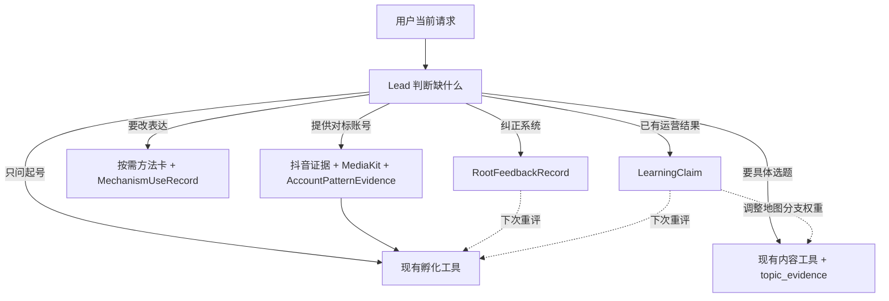

# A98 现有模块最小接线审计

## 结论

这件事在产品逻辑上确实不复杂。第六版已经有总脑、项目台账和大部分业务模块，不需要新建第二套编排器、
固定多 Agent 队伍、向量数据库或新的营销领域包。最小结构是：

```text
一个 Lead
+ 一个项目产物台账
+ 三个薄连接件
```

三个连接件分别是：

1. **账号模式证据桥**：抖音账号/作品 + MediaKit 时序观察 -> 可追溯的账号模式证据。
2. **方法采用记录**：本轮用了哪张方法卡、基于什么证据、预期改变什么。
3. **反馈学习记录**：用户纠错先校准内容根和地图；未来发布结果再校准方法、选题和账号策略。

## 已经接好的主干

### 首次孵化

现有 `develop_account_strategy` 已经完成：

```text
可信用户/线程
-> 惰性创建或读取项目
-> content_intelligence 语义与候选内容地图
-> 读取同项目正式对标和受众证据
-> 生成 2 至 5 条账号路线并推荐
-> 用户确认后写入版本化 IncubationJudgment
```

因此语义、内容根、内容地图、定位、受众、人设、表现形式和变现不需要另写一个总工作流。

### 单条内容

现有内容工具已经完成：

```text
已确认账号策略 + 当前请求
-> 网页与抖音 topic_evidence 并行取证
-> TopicBrief
-> MessagePlan
-> DraftVersion
-> FormatDecision
-> AdaptedDraft
```

产物都保存到同一个项目，带父级、版本和哈希。制作可以继续暂停，不影响前半段孵化和内容学习。

### 证据与工具

- 抖音 MCP 已能渐进发现能力，并能把普通选题资料与对标候选分成不同证据角色。
- `collect_douyin_benchmark_candidate` 已能按作者聚合公开作品候选并保存项目证据，但稳定账号身份、完整作品
  样本与 MediaKit 拆解还没合成正式账号模式证据。
- `EvidenceSnapshot`、`BenchmarkSnapshot` 和受众证据已有有界 Lead 投影。
- MediaKit 已有动态 Schema、受控输入输出、回执、哈希和部分真实本地验收。
- HLLM 已有伪名 actor、最多 50 条行为序列和推理回执边界，但没有真实线上推理与群体聚合。

## 三个薄连接件

### 1. AccountPatternEvidence

它不是新账号分析系统，只是把已有观察放进一张可复核记录：

```text
父级：BenchmarkSnapshot + MediaKit receipts
观察：说了什么、画面出现什么、何时发生
功能：开场、证明、延迟、反转、行动邀请等
解释：可能对受众有什么意义
适配变量：哪些功能可换成用户自己的内容
不可复制：人物身份、原台词、品牌资产、偶发事件
重复模式 + 反例 + 覆盖缺口
```

它进入现有项目证据选择，不直接输出“这个账号为什么火”或替用户确定定位。

### 2. MechanismUseRecord

金枪大叔、薛辉、亲爱的安先生和文案三把刀的方法卡不需要各自成为 Agent。亲爱的安先生目前不是独立
Skill 目录，而是 `distill-screen-methods` 中已经蒸馏的方法组，负责概念构建、并置/演绎/转换、时间语法、
观众参与和把“网感”还原为具体的人。Lead 在内容根和具体选题已经明确后，按需读取一至数张相关卡，并
保存一条采用记录：

```text
method_id + version
作用对象：账号路线 / 选题 / MessagePlan / 表现形式
采用或拒绝
依据的项目证据
本轮机制假设
预期观察信号
适用条件、替代解释和不可复制边界
```

未采用的方法不执行；所有方法都只是本项目中的候选假设。

### 3. FeedbackRecord

反馈有两个来源，但进入同一学习入口后仍保持不同类型：

- **当前可做**：用户选择与纠错形成 `RootFeedbackRecord`，校准候选内容根、地图分支、账号路线和方法偏好。
- **后续恢复发布后**：回执、指标和受众结果形成 `LearningClaim`，校准选题、形式、方法和账号策略。

用户纠错是显式监督；平台结果是带噪声的观察。二者不能互相冒充，也不能在线改核心提示或 Skill。

## 按需路由，而非固定流水线



调用规则很简单：

- 没有视频就不启动 MediaKit。
- 没有真实逐受众行为就不启动 HLLM。
- 用户只问起号时，做到路线提案就停止。
- 用户没有要求找对标时，对标缺失只降低置信度，不阻断孵化。
- 内容根未冻结前不让文案方法决定方向。
- 热度、播放量和单条评论不能自动修改内容根。

## 内容根与内容地图如何被校准

每次内容必须保留以下绑定：

```text
IncubationJudgment version
-> content_root
-> exact content-map path
-> TopicBrief
-> method/format choices
-> user feedback or published outcome
```

反馈更新不同速度的判断：

| 对象 | 更新信号 | 更新速度 |
| --- | --- | --- |
| 具体选题 | 用户选择、成稿反馈、单条结果 | 快 |
| 地图分支 | 多条选题的受众匹配、持续产能和结果 | 中 |
| 内容根 | 跨分支长期受众、信任和业务承接 | 慢 |
| 通用方法卡 | 多项目复现 + 全新冻结评测 | 最慢 |

一次失败先区分曝光不足、选题错误、表达错误、受众偏移和外部事件，不能直接判定内容根失败。

## 最小实施顺序

1. 测试先行实现 `AccountPatternEvidence`，把第五版仓颉式五层语义薄迁入现有项目证据，不迁整套 E15。
2. 测试先行实现 `MechanismUseRecord`，再把四位创作者图谱拆成小方法卡并延迟加载。
3. 实现 `RootFeedbackRecord` 的追加保存和最小用户选择入口，先跑无需发布的学习闭环。
4. 使用抖音真实回执与 MediaKit 视频样本验收账号证据桥。
5. 发布线恢复后再实现 `LearningClaim`；HLLM 在真实行为和群体聚合通过后插入同一证据入口。

## 不新增的东西

- 不新增 Marketing OS 或第二套数据库。
- 不新增固定编排工作流或固定子 Agent 阵容。
- 不把四个 Skill 常驻核心提示词。
- 不为这些连接件改写现役内容根算法。
- 不要求用户先绑定平台账号才能获得初步孵化方案。
- 不让发布、MediaKit 或 HLLM 成为冷启动硬门。

## 判定

现有系统已经完成大部分“模块”，当前工作不是继续造模块，而是让三类记录进入同一项目谱系。用户看到的
流程仍然可以只有一句话：“我是做什么的，我该怎么起号？”复杂的取证和学习只在确有需要时由 Lead 后台
补齐。
