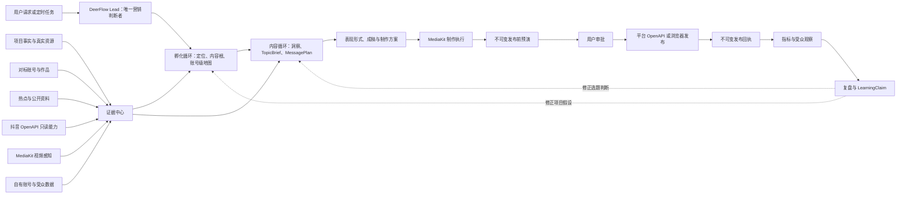

# ADR-018: 以孵化为中心的产物图编排

## 状态

`reviewed -> adopted; W01 artifact spine implemented; runtime product integration pending`

## 背景

第六版已经形成语义理解、账号级内容地图、联网取证、`TopicBrief`、
`MessagePlan` 和基础文案的可运行纵切，也已建立抖音 OpenAPI 的 Catalog 与
Manifest 路由。但账号证据、受众情报、MediaKit、表现形式、制作、发布预演、
审批、发布回执、指标与复盘仍分布在第五版隔离实验、第四版旧领域层和独立
Skill 中。

如果将它们按旧版方式整块迁回，会同时带回固定阶段、必填状态、评分硬门、
多个 Agent 争夺营销判断权和巨型合同。如果只保留当前内容脑，又无法完成 MCN 的
孵化、创作、发布和学习闭环。

因此系统需要一个总编排原则：模块职责可以独立，但不能形成彼此断开的工作岛；
业务不应被强制塞进一条从一到十二的固定流程。

## 决策摘要

第六版采用：

> **一个总脑、三条循环、两个执行底座、一套事实台账。**

1. DeerFlow Lead 是唯一对用户输出孵化与新媒体判断的总脑。
2. 业务由孵化循环、单条内容循环和发布后学习循环组成。
3. MediaKit 是媒体感知与制作执行底座；平台 OpenAPI 与本地浏览器 MCP 是平台观察与
   操作执行底座。二者都没有营销判断权。
4. 所有模块通过版本化、内容寻址的业务产物相连，而不是依靠聊天记忆或自由文本传话。
5. 运行时是按需补齐产物的图，不是所有请求都必须走完的固定工作流。

## 整体图



## 三条循环

### 孵化循环

孵化循环回答账号长期成为谁、为谁解决什么、长期讲什么和凭什么被信任。它可以读取
项目事实、对标证据和市场资料，产生版本化的孵化判断与 `ContentWorldVersion`。实时热点
和一次高播放不能直接改写账号定位。

### 单条内容循环

单条内容循环从已确认的内容地图、当前问题或用户指定素材出发，经取证后产生
`TopicBrief -> MessagePlan -> DraftVersion -> FormatDecision -> MediaArtifact`。洞察是证据阅读
到 `TopicBrief` 之间的判断能力，不是一个自由行动、可以重选内容根的新 Agent。

### 发布后学习循环

学习循环绑定发布前预演、审批内容哈希、平台回执、指标快照和受众观察，产生一条可修正的
`LearningClaim`。学习结果可以改变项目假设和下一轮选题，但不得自动改写核心提示词、
Skill 或跨用户通用规则。

## 执行底座边界

### MediaKit

MediaKit 同时有两个受限角色：

- 感知：从授权视频取得元信息、ASR、OCR、场景边界和其他机器观察，进入账号或素材
  证据包。
- 制作：对已经确认的脚本、素材和形式决定执行剪辑、字幕、裁剪、混音、合成、增强与质检。

MediaKit 回执必须保存输入哈希、动态 Schema 哈希、CLI 版本、执行模式、幂等令牌哈希、
任务 ID、输出哈希、费用与云处理授权。它不得直接声明账号定位、爆款原因或可复制策略。

### 平台连接器

抖音 OpenAPI 优先承担已审阅、已授权的公开搜索、账号读取、素材、发布、指标、受众和
线索能力。官方没有、当前应用未授权或只有页面操作的能力，才由账号级本地浏览器 MCP
补齐。两条路径都输出同一个平台回执合同，不让上层内容模块感知 Cookie、Token、URL 规则或页面细节。

普通搜索、对标账号、自有账号和发布后实绩必须使用不同证据角色，不得互相冒充。

## 事实台账与产物图

首批业务产物为：

```text
IPProject
-> PlatformAccount
-> IncubationDecisionVersion
-> ContentWorldVersion
-> EvidenceSnapshot / BenchmarkSnapshot / AudienceSnapshot
-> TopicBrief
-> MessagePlan
-> DraftVersion
-> FormatDecision
-> MediaArtifact
-> PreflightPrediction
-> ApprovalGrant
-> PublicationReceipt
-> MetricSnapshot
-> Retrospective
-> LearningClaim
```

这不是一个每次必须从头走到尾的顺序表。每个产物至少保存：

- 所有者与项目引用；
- 稳定产物 ID、类型、版本和状态；
- 内容哈希与父产物引用；
- 观察时间、来源角色与覆盖说明；
- 可见的未知、限制和当时采用理由。

用户可以只请求对标分析、只请求一条选题，也可以提供完整成片直接要求发布。Lead 只读取
当前任务所需的有界投影，并按需产生缺失产物，不为显得完整而自动跑全流程。

## Agent 与确定性代码的分工

只有需要开放世界理解、解释或创意判断的工位使用模型工作者，例如语义阅读、证据阅读、
对标模式分析、选题收敛、成稿和复盘诊断。这些工作者可以受控并行，但不得直接修改共享状态、
审批发布或自动晋升学习规则。

以下职责使用确定性代码：

- 身份、所有权、授权、费用与审批校验；
- 产物 ID、哈希、父子绑定、版本和幂等；
- API 参数与输出 Schema 校验；
- MediaKit 任务提交、轮询、恢复与回执；
- 指标聚合、基线归一化、时间窗口与异常标记；
- 发布状态机、崩溃恢复与未知结果对账。

## DeerFlow 是编排底座，不只是聊天壳

第六版不新造第二套 Agent 运行时。现有 DeerFlow 能力按职责复用：

- LangGraph run lifecycle、checkpoint 与 run ownership 承担交互式运行、中断恢复和多工作者所有权。
- `task` 子 Agent 只承担可并行、可失败的深研究、对标分析或大样本复盘；已有内容脑内的
  结构化工作者继续作为同一 Tool 内的受控调用，不全部升级为 `task`。
- MCP 承担抖音和后续平台连接器；`tool_search` 与 Manifest 渐进披露保证 Lead 不会同时看见全量平台工具。
- DeerFlow Skills 承担按需方法，如对标观察、表现形式、叙事成稿和复盘方法；启用延迟发现和
  工作者 allowlist，不把全部 Skill 注入核心提示词。
- DeerFlow Memory 只保存用户稳定偏好、显式纠错和可对话的长期上下文；项目事实、版本、审批、
  回执和指标仍以业务数据库为真相源。
- Sandbox、上传与 artifact 路由承担素材隔离、中间产物与用户下载；媒体程序不直接读取其他用户路径。
- Scheduler 承担定时发布、指标回收、未知结果对账和定期复盘，但必须复用正常 Gateway run lifecycle。
- 长耗时 MCP 或云端媒体任务使用数据库租约、耐久任务快照和重启恢复，不把轮询留在 Agent 思考循环里。
- SSE/StreamBridge 承担研究、媒体、发布和复盘进度；工具大输出使用现有外部化与有界摘要。
- Summarization 保持聊天可持续，但压缩后仍从业务台账重建当前项目投影，不把聊天摘要当业务数据库。
- Authorization、guardrails、tool progress、circuit breaker 和并发限制承担资源级权限、故障降级和成本保护，
  不对营销观点做语义硬门。

“压榨 DeerFlow 能力”的验收标准是减少重复运行时、提高恢复、隔离、可观测性和上下文效率，而不是
强制每个 DeerFlow 功能出现在每一次业务请求里。

## 唯一硬门边界

语义、内容地图、选题、成稿和复盘可以在信息不完整时带着未知继续。硬拦截仅用于：

1. 用户、项目、平台账号与素材权利不匹配。
2. 密钥、Token、Cookie 或临时素材地址即将越过受信边界。
3. 云处理、付费或资源消耗超过已授权上限。
4. 发布、发送、删除、修改、交易等不可逆操作没有内容绑定审批。
5. 幂等冲突、并发租约冲突或上次执行结果仍为未知。
6. 有明确来源的法律、平台和业务禁止规则。

这些硬门只约束执行真实性和不可逆风险，不评分营销思路，也不替模型选内容根。

## 不采用

- 不把所有模块平铺成 Lead 可见工具。
- 不让每个模块各自维护一份项目真相。
- 不设定固定子 Agent 阵容或要求每次都完成访谈、对标、选题、脚本和实验。
- 不让 MediaKit、平台 API、评分器或复盘器重新选择内容根。
- 不将第四版整个 `personal_ip` 包、旧 SOUL、中间件和已退役语义表迁入第六版。
- 不因抖音能力进入 Catalog 就宣称已经进入生产。

## 迁移原则

旧版迁移单位是“一个小合同、一个可归因能力、一组先失败后通过的测试”，不是目录、
文件或提示词整块复制。未提交的第四版修改只作为失败证据，不作为候选实现。

每个迁移模块都要经过：

```text
discovered -> traced -> reviewed -> adopted/rejected
-> implemented -> verified -> production
```

`implemented` 不等于 `production`。真实账号、真实平台回执、崩溃恢复和所有权隔离没有通过时，
必须保留未验收状态。

## 验收边界

1. 同一项目可以只运行账号定位、只运行对标分析或从用户成片直接进入发布，不被
   无关阶段拦截。
2. 任何发布回执都能追溯到用户、账号、审批、成稿和媒体哈希。
3. 任何复盘都能追溯到发布前预演和指定时间窗口的实绩快照。
4. 对标证据、热点证据、自有账号证据和发布实绩无法被错误投影为另一种角色。
5. MediaKit 感知错误可以被人工纠正，且机器观察不会自动升级为营销事实。
6. 连接器密钥、Token、Cookie、临时素材 URL 和本地路径不进入模型、前端、日志、测试或业务台账。
7. 新证据可以修正旧判断，但旧版本、修改理由和反例都被保留。

## 当前诚实状态

- 第六版内容脑已进入本地候选运行时；W01 项目、账号和产物 SQL 台账已实现，Lead/API 的项目选择与
  重水化尚未接线。
- 抖音 OpenAPI Catalog 和 MCP 路由已实现，当前采用的 Child 只有 `video_search` 和
  `experience_search`。`video_search` 的 `topic_evidence` 白名单适配和有界 Lead 投影已实现，生产
  Tool 自动写入项目尚未完成。
- 第五版 E15 中 MediaKit 元信息、ASR、OCR 和场景切分已有真实回执，但仍是隔离实验。
- 第五版对标账号、账号证据与受众情报已有部分真实抖音验收，但未注册为第六版运行时能力。
- 第四版预演、发布回执、指标和复盘代码只作为可靠性来源，不代表第六版已经接通。

具体工作包、迁移矩阵和端到端验收顺序见 `../IMPLEMENTATION_PLAN.md`。
