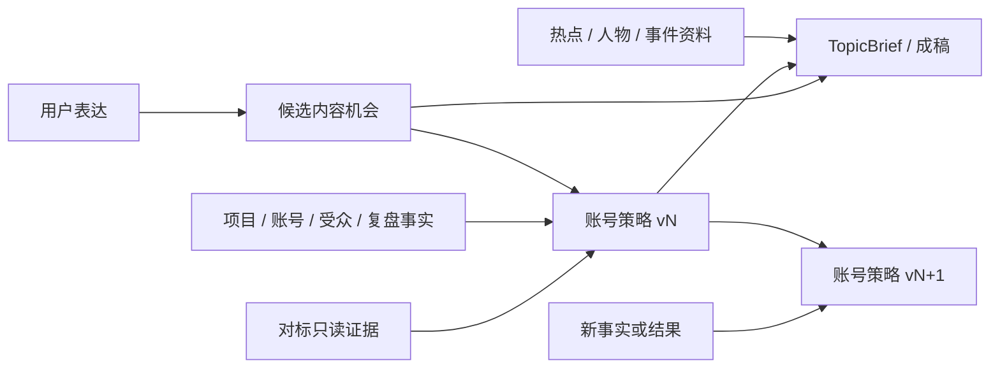

# ADR-021 分离候选内容机会、对标证据与账号策略

## 状态

`accepted`，2026-08-18。

本决策取代 ADR-017 中“内容地图本身就是账号级编辑定位”的运行时结论。ADR-017 的地图版本、
防漂移和选题绑定经验继续保留，但地图降为候选输入。

## 背景

账号定位会随账号、受众、发布结果和复盘变化；语义读取和内容地图则是对一次商业表达的可检查理解。
对标账号又是外部观察。旧实现把三者和单条内容生产塞进同一工具，并在 TopicBrief 之后临时生成账号
判断。这让定位无法指导选题，却能倒灌成稿；一条婚礼、购买或到店场景也可能被误当成长期定位。

## 决策

采用四个单向依赖的业务边界：

1. `ContentWorldView` 是 `content_map_candidate`。它只拥有候选地图根、可研究方向和边界。
2. `BenchmarkSnapshot` 与受众观察是只读证据。它们不能选择内容根或直接下定位结论。
3. `develop_account_strategy` 是长期账号判断的唯一高层入口。`IncubationJudgment` 分开保存定位、受众、
   人设、账号级表现方向、变现、未知与备选。
4. 判断是不可变版本。输入不变时复用；输入变化时必须引用紧邻上一版并记录修改原因。
5. 单条选题可以读取与当前候选地图精确匹配的现有判断，但不能在内容运行中创建或修订判断。
6. 语义、地图、对标、账号策略和选题通过内容寻址父产物连接，不通过聊天记忆互相传话。

## 结构约束

- `content_intelligence_tool.py` 不得导入或调用正式证据选择器、账号判断生成器或账号策略写服务。
- `ContentWorldView` 与候选地图产物不得包含定位、人设、账号级表现形式或变现字段。
- `IncubationJudgment v2+` 必须有上一版 ID 和修改原因；上一版必须属于同一项目和账号。
- `benchmark_account_candidate` 不得冒充正式 `BenchmarkSnapshot`。
- 窄场景只以 `example_branch` 进入候选地图。不得用婚礼、宴请、购买、到店等关键词硬编码业务答案。
- 缺少账号策略不阻止内容机会和选题探索，只产生“当前没有已采用策略”的事实状态。

## 结果

优点：

- 定位终于成为可复盘、可修订、可比较的长期对象。
- 对标数据可以更新而不污染语义和地图。
- 一条选题不再偷偷制造一份新定位。
- 婚礼等具体场景只能作为候选分支，不能跨模块累计权重后篡位。
- 将来同项目多账号可以在不复制语义系统的前提下拥有不同策略。

代价：

- 起号请求需要先选择项目；未来还要增加平台账号绑定和策略采用界面。
- 候选地图不再自动等于最终答案，Lead 必须正确路由内容机会与账号策略请求。
- 当前正式对标快照的生产连接器尚未完成，账号策略只能使用台账中已经存在的正式证据。

## 不采用

- 不继续在一个工具里加阶段字段或条件分支。
- 不让多个自由子 Agent 分别写定位、受众和人设后投票。
- 不让内容地图自动升级为账号定位。
- 不让对标分析直接复制成当前用户方案。
- 不增加婚礼、彩礼、购买、宴请等行业关键词黑名单。

## 后续

1. 增加线程到具体 `PlatformAccountRef` 的服务端绑定。
2. 增加策略采用、切换、版本对比和人工修改原因界面。
3. 完成抖音稳定身份、作者一致多作品与覆盖回执到正式 `BenchmarkSnapshot` 的连接器。
4. 用全新留出案例验收候选地图、账号策略和单条选题三层质量，不复用 A78 的黄金答案调参。
