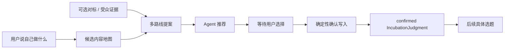

# ADR-022 账号路线先提案、再由用户确认

## 状态

`accepted`，2026-08-18。

本决策扩展 ADR-021 的独立账号策略边界，不恢复内容工具对定位的写权。

## 背景

ADR-021 将账号判断从候选内容地图和单条选题中拆出，但仍是“模型生成一份判断即可被下游读取”。这无法区分
Agent 的推荐和用户的选择，也无法同时展示真人出镜、无人素材、数字人或 AI 叙事等资源和代价完全不同的账号路线。

## 决策

1. 新提案必须有 2 至 5 条 `AccountRouteOption`，且 `decision_status=proposed`。
2. 模型只生成扁平 `AccountStrategyProposalDraft`。服务端编译为版本化、证据绑定的 `IncubationJudgment`。
3. `recommended_option_id` 是建议；`selected_option_id` 只能由 `confirm_account_strategy` 在用户选择后写入。
4. 每条路线将 `content_subject` 与 `business_connection` 分开。前者服从冻结候选地图；后者保留从业视角、信任与承接。
5. 后续选题只读精确地图版本的 `confirmed` 策略。显式单条选题请求仍可以在没有账号策略时独立工作。
6. 项目级首次提案和确认不需要平台账号登录、绑定或 OAuth。缺少正式对标证据降低置信度，不形成冷启动硬门。

## 结构约束

- 模型可见提案 Schema 不得包含 `revision_number`、`decision_status` 或 `selected_option_id`。
- `confirm_account_strategy` 只能选择最新提案中存在的 `option_id`；已确认同一路线的重放幂等复用。
- 推荐路线不得在确认前作为选题路径的账号定位依据。
- 对标证据仍为只读父级；不得替用户选择路线。
- 不根据行业词编码“应该选口播”或“应该选 AI 短剧”。

## 代价与后续

- 首次起号变成两轮交互，但换来真实的用户决定和可追溯版本。
- 无正式对标时的推荐只是低/中置信度候选。
- 当前完整链路约需四分钟，后续需独立做模型调用数、重用和延迟优化，不为提速恢复语义硬门。
- 平台账号绑定、多账号策略与可视化选择界面延期。

## 不采用

- 不让 Lead 在同一次回答中自行提案、自行确认并继续生成选题。
- 不让模型直接填写深嵌套的持久化合同。
- 不把平台账号登录当成冷启动孵化的必要条件。
- 不将用户的商业对象默认塞回每条长期内容主体。
